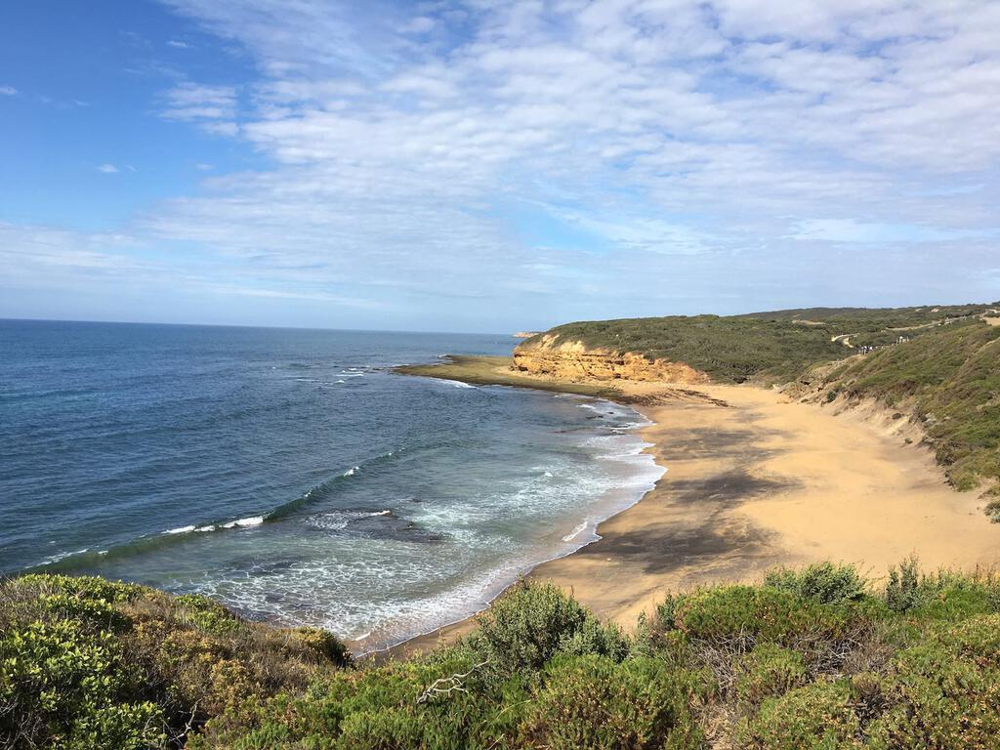
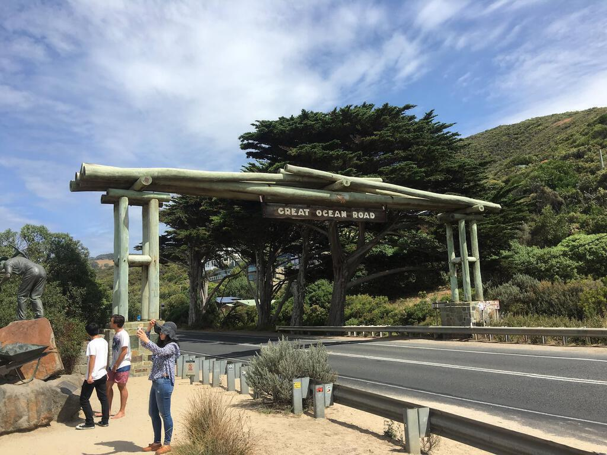
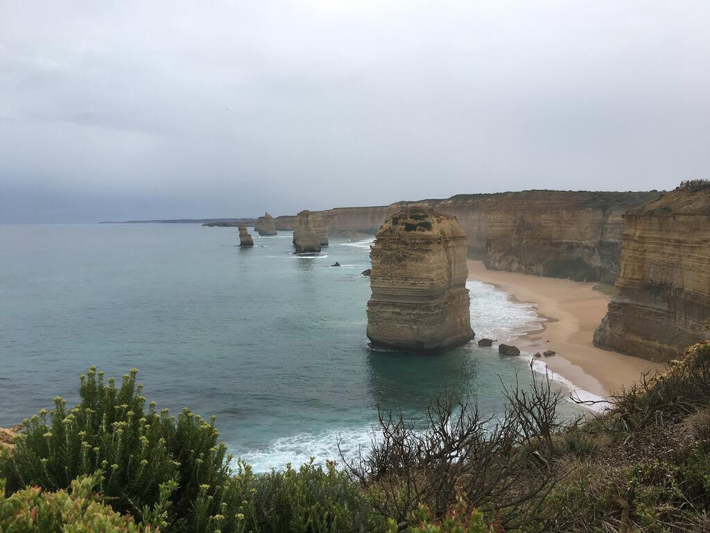
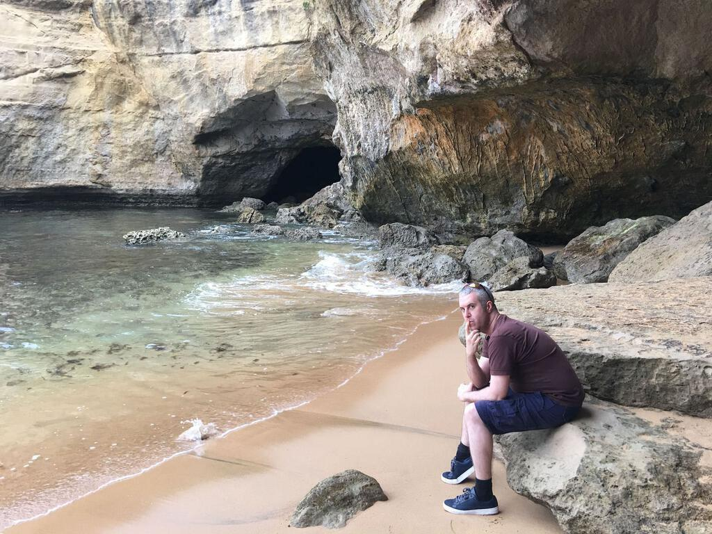
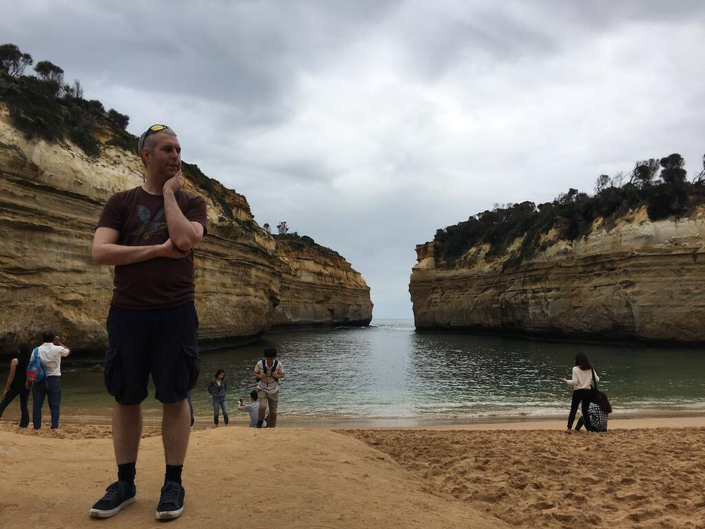
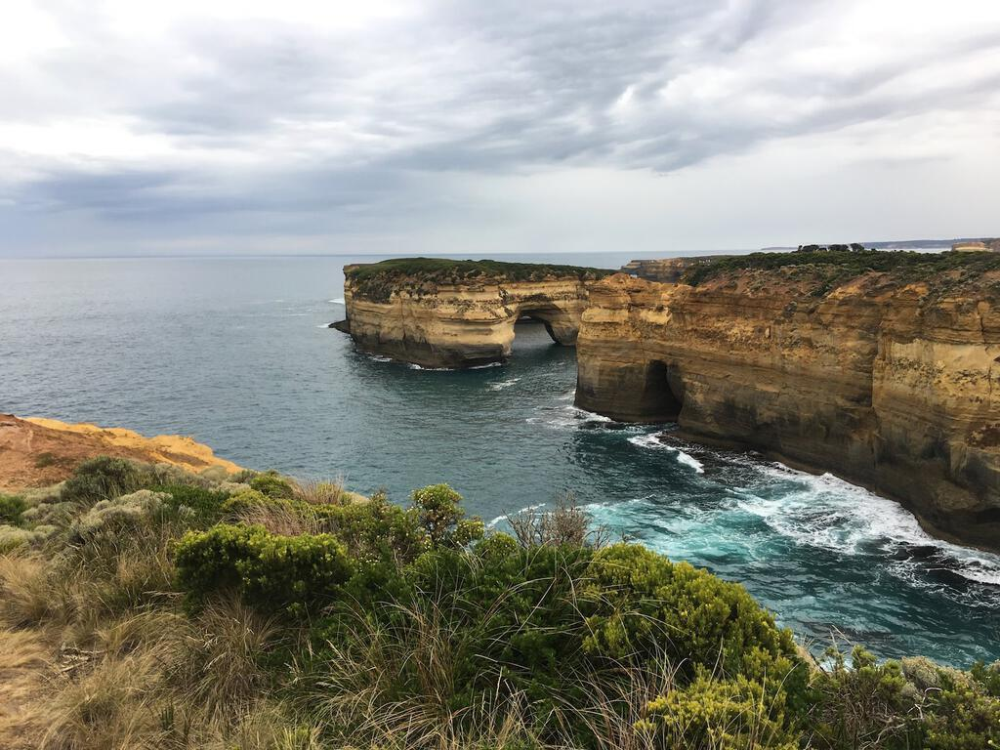
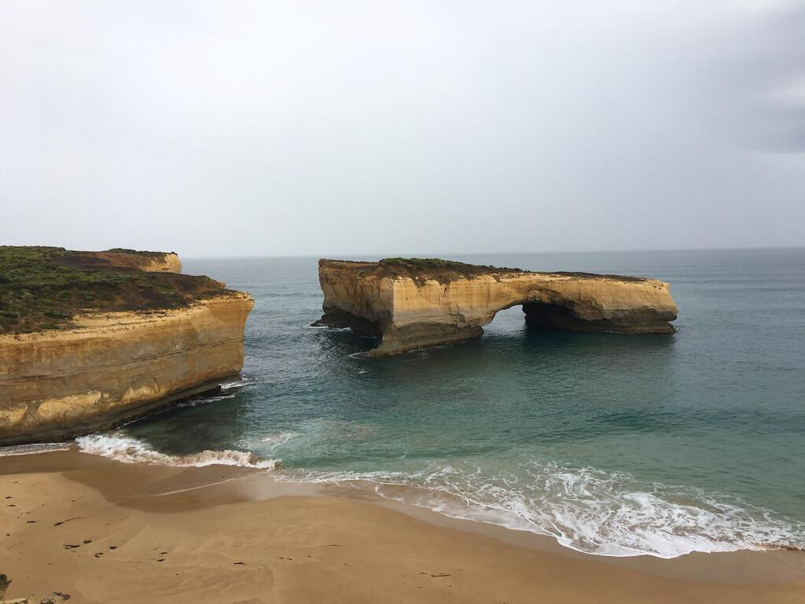
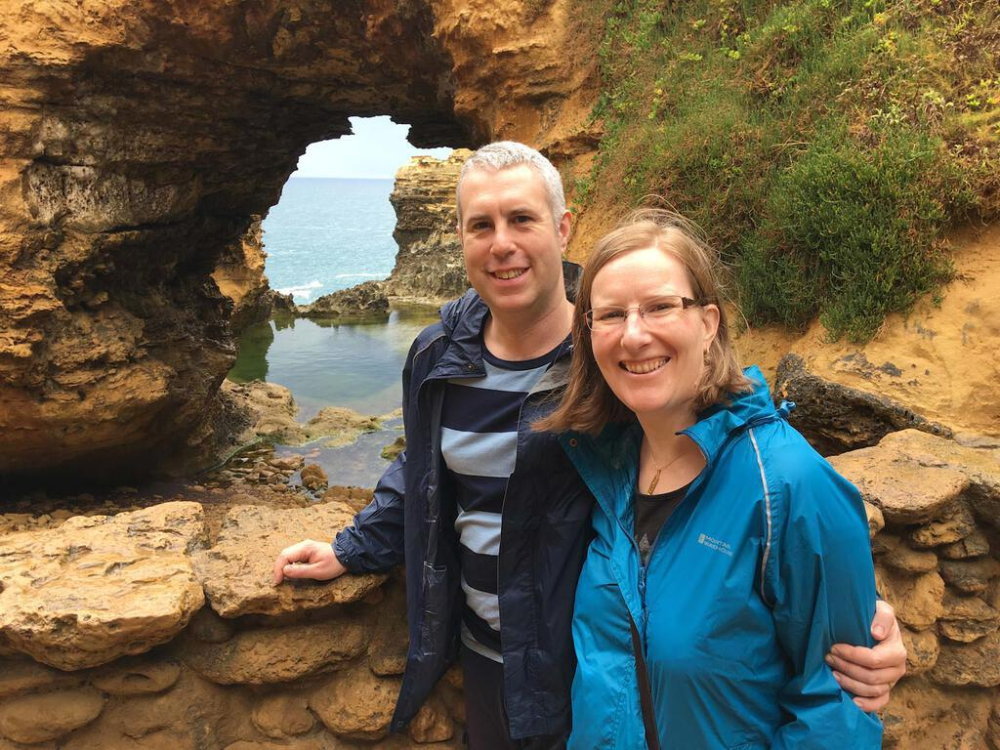
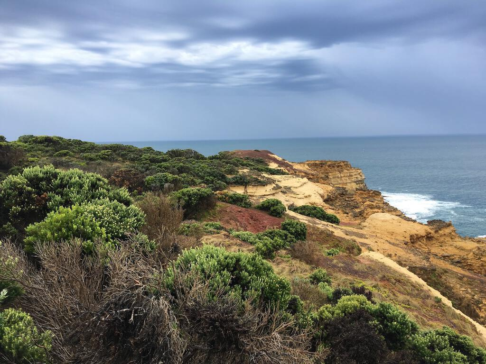
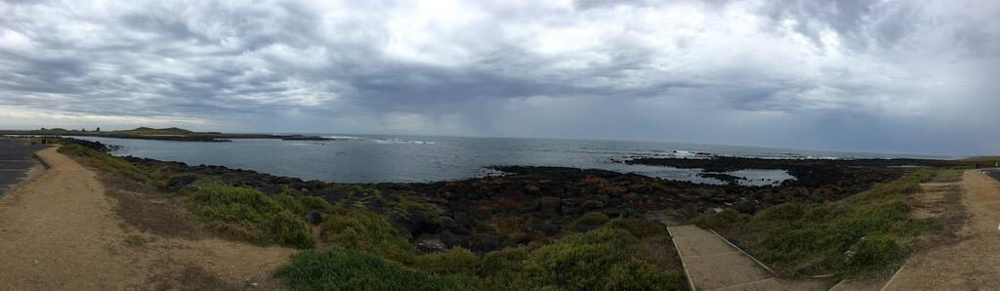

As a [wedding present](articles/the-same-yet-different), Maria and Gary kindly took us for a drive along [The Great Ocean Road](https://en.wikipedia.org/wiki/Great_Ocean_Road), the longest war memorial in the world.

Stretching 151 miles from Torquay (not that one!) to Allansford, the road was deliberately built as a tourist attraction as a means of providing meaningful work for troops returning home from the First World War. Regarded as one of the world's greatest scenic roads, it certainly holds it own against things like the roads I experienced in Chile and Bolivia when I travelled over the Andes.

On the first day we travelled from Lara to Port Campbell, taking in many breathtaking stops along the way. These included [the twelve apostles](https://en.wikipedia.org/wiki/The_Twelve_Apostles_(Victoria)), which are very popular with tourists even though there are only eight left, and [Loch Ard Gorge](https://en.wikipedia.org/wiki/Loch_Ard_Gorge), which has a fanciful tale of a shipwreck to entertain vistors. Other highlights were a stroll along the beach and later on a walk around a fern gully. 

On the second day we finished the section that we would be travelling, up to Port Fairey. Our drive back to Melbourne took an inland route. I was interested in just how much space there is in between places in Australia and of course in relative terms the journey was minuscule. 