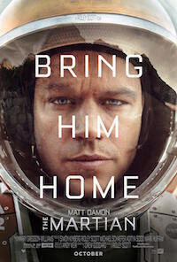

[In my review of the book](/the-martian-by-andy-weir/) I mentioned that a film adaptation of The Martian was on the way. I'm not sure why but it got released earlier than any of the dates that I'd seen and so on Saturday I found myself watching The Martian on the big screen. Could the film version deliver the same level of entertainment as the novel? Could Mark Watney (Matt Damon) get off Mars alive?

The short answers are (spoiler alert!) yes and yes. The Martian is at least as enjoyable as a film as it is a novel. The change in medium has both pros and cons, but overall it's great fun whether you've read the book already or not.

In my blog post about the novel, I wrote about what I perceived to be the filmic qualities of the writing about the Martian surface and the computer generated shots of the landscape are stunning. What's more the film also looks fantastic at the "suit level", there's great attention to detail in the structure of the habitat module [and the space suits](http://news.yahoo.com/inside-martian-movies-sleek-spacesuits-explained-183716716.html). It's almost a shame that this convincing detail almost gets overlooked by the need to propel the film along, I'd love to have luxuriated in the world building of the film. I bet there'll be a stack of extras with the Blu-ray in a few months time.

It's a long film, not that a great deal of it feels extraneous or forced. One of the weaknesses of novel is that the story unfolding back on earth and on the Hermes ship felt a little forced and underwritten compared to the experiences of Mark Watney on Mars. I think that the film goes a little way to address these issues and that pads out the run time. There are some good supporting performances from Jeff Daniels, Sean Bean, Kirsten Whig, and Mackenzie Davis (it took me a good few hours for me to realise that I'd recognised her from the excellent TV show ["Halt and Catch Fire"](http://www.amc.com/shows/halt-and-catch-fire)). As an ensemble piece, it's solid rather than spectacular.

Matt Damon does a good job as Mark Watney, though I think the film presents Watney as more of an action hero than the book does. Plenty of the charm and wit comes through, with a large amount of the diary entries of the novel taken verbatim and presented in a video diary format. There are a few awkward moments where I noticed the camera work and found that it was breaking my belief that he was alone: in space no one can hear you scream except the camera crew.

Plot-wise plenty has been cut from the book but as I've said, it's actually a pretty long film and sticking to it slavishly would require a TV series. Because the novel was originally a serial there are a lot of twists and for the film a few had to be straightened out lest it go full Avatar (i.e. go on forever). What remains is still pretty twisty. I was disappointed that a great scene with a dust storm was omitted, but maybe it's a deleted scene on the DVD or maybe there's an extended cut. Maybe that extended cut should just be a quick re-read of the novel.

"The Martian" is a good film with plenty to keep you entertained. The score and soundtrack are both excellent too, I think the former might be my "slip off to sleep" soundtrack for a few months: with lots of gauzy drones and cute little piano loops, it seems indebted to Brian Eno's "Apollo: Atmospheres and Soundtracks". The soundtrack is mostly disco (this is a plot point) and provides some uplifting and amusing moments throughout. Naturally the end credits roll to the sound of Gloria Gaynor's "I Will Survive", which is a nice touch. Highly recommended.
