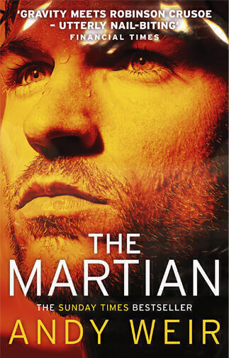

I received a copy of The Martian by Andy Weir for Christmas. This week during some annual leave I managed to finish it. It's one of those novels that just flies by once it gets going. I've stayed up incredibly late to read it as it is full of those "just one more page" moments. It’s a readable and enjoyable story of an astronaut trapped on Mars.

Mark Watney is believed to be dead following an accident during an emergency evacuation in a dust storm. With his life support readings at zero and unable to locate his body to be certain, his crew reluctantly abandon him on the red planet.

Mark survives but knows that he does not have enough food or water to survive long enough to be rescued. In the novel missions to Mars operate by sending an ascent vehicle in advance of a future mission - that's the rocket that his colleagues escape in on page one. However there's another mission, which means that there is another ascent vehicle. If he can work out how to get there and somehow produce some food so he can survive long enough, there is a chance that the next mission can collect him.

Meanwhile NASA discovers that Watney is still alive and makes plans to help him. This is where Weir's writing lets him down a little. The characterisation of the secondary characters is weak and some of these sections contain very clunky dialogue. The voice that Weir gives to Mark is unusual and plays against our stereotypes of what we might expect of an astronaut, perhaps even to the point of stretching credibility. This makes all the sections that feature his point of view very entertaining. It's a shame that the other bits around those sections feel like cliché.

I did like the shifting point of view though, it's a competent patchwork of styles with Mark's journal as the main fabric and various forms of third person narration filling in the gaps. Especially effective are the sections that slow the action down and present Mark at the scale of the empty planet around him. These sections are almost like a film: I imagine huge pull back shots to point where he is a tiny speck on the screen.

I think another writer might have used a more consistent structure. Sometimes it felt like each new development in the plot had to be introduced in a new style or with a new trick. This is a minor quibble, it certainly didn't put me off reading to the end. However The Martian is, stylistically at least, almost as ramshackle in places as the protagonist's modifications of his gear.

What ultimately saves The Martian and elevates it above a mere Boy's Own tale of being lost in space is the forensic attention to detail. The characters may feel a little rusty and the writing a little showy, but the effort put into creating a vivid and believable scenario shines through. It's the attention to detail that makes Mark into a credible character that we fight alongside and identify with. I learned a lot about oxygen, hydrogen, water, and carbon dioxide from this novel!

The Martian has an interesting pedigree that puts it alongside books like Fifty Shades of Grey and Hugh Howey's Wool in that it was self-published online first, became a big hit in print and is now headed for your movie screen. As soon as the 27th November this year in fact, starring Matt Damon and Jessica Chastain. The film version is directed by Ridley Scott whose sci-fi pedigree includes Alien (making this the second post in a row to hint that I will write about this film soon) and Blade Runner.

The film intrigues me. Obviously I'm excited to see how The Martian looks on screen but so much of the fun of the novel is communicated in those first person logs and the vivid description of the technical details. It'll be interesting to see how that works out. I recommend the film on the basis of the novel, though as with any other adaptation I also think you'll better off enjoying the book first. It's a cracking story and the film may address some of the novel's flaws, but it's harder to see how the intimacy of the first person narrative will come across. It's not impossible though, it's a trick that Moon managed to pull off. Also Mars movies are generally a disaster at the box office so it will be interesting to see whether The Martian can buck that trend.

To conclude, The Martian by Andy Weir is funny, gritty, exciting, and believable. It's good for getting away from it all (it's out of this world!) and it's good for revisiting school chemistry lessons. Best of all, it makes a strong case for horticultural experiments on manned space missions to include more than just potatoes.

---

The [featured image](http://upload.wikimedia.org/wikipedia/commons/d/dc/PIA17944-MarsCuriosityRover-AfterCrossingDingoGapSanddune-20140209.jpg) is a photo taken by the Curiosity rover on the surface of Mars. I found it at [a Wikipedia article about the surface colour of Mars](http://en.wikipedia.org/wiki/Mars_surface_color), via Google Images.
