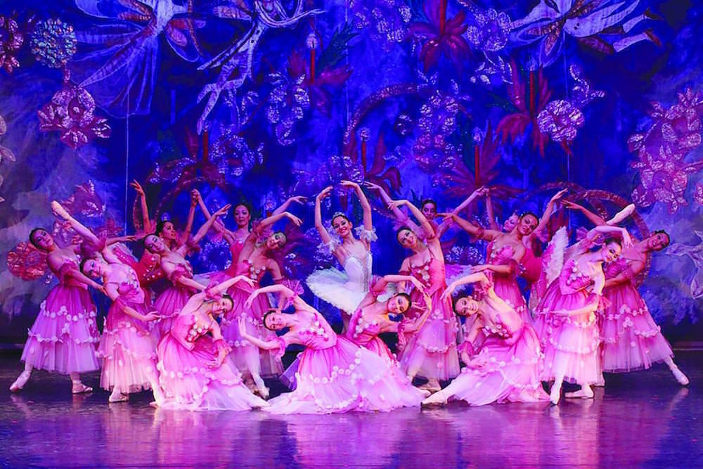
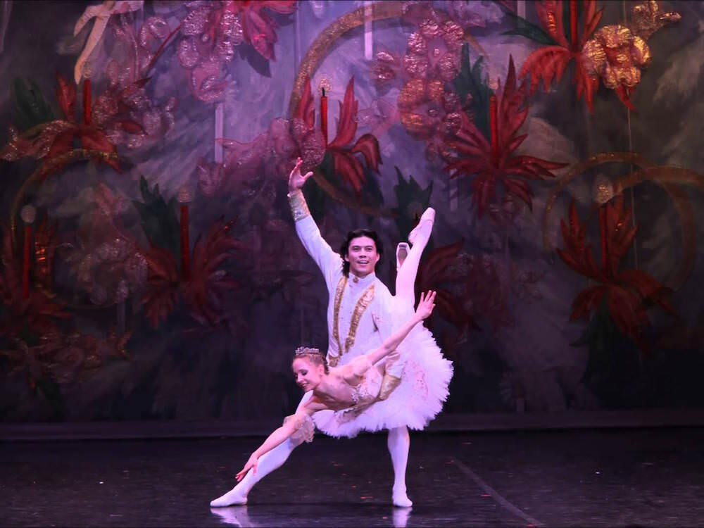

For Ingrid's birthday, we went to see [The Nutcracker performed by the Moscow City Ballet](http://moscowcityballet.com/en/repertoire/ballet/1) at [The King's Theatre in Southsea](http://kingsportsmouth.co.uk).

The original conversation went something along the lines of "Matt, please come and see some ballet with me on my birthday! It might not be your thing but I'd love someone to come and see it with me". As I've always loved a bit of Tchaikovsky, I said yes.

My only previous encounter with a ballet was an adaptation of [Christopher Marlowe's Edward II by John McCabe](https://en.m.wikipedia.org/wiki/Edward_II_(ballet)) during my English Literature A-level. We got a day trip to exotic Bristol out of it, which when I was 17 meant the chance to visit all the cool record shops looking for rare KLF vinyl that I couldn't afford. We also got underage hammered at the pub before going to the Hippodrome to watch a ballet in which a man flounced around with a giant pink strap-on on (as if male ballet dancers didn't have enough of that action going on already!). Needless to say, it did little to convert me.

The Nutcracker is an altogether more benign proposition, full of childlike wonder and hummable tunes. The latter attested to by the elderly gent in the seat next to me suddenly humming the odd couple of notes now and then. I think if any ballet show could win me over it would be this.

The initial set, that of a Christmas party, would normally be a little out-of-place this far into January. But not in Portsmouth ahead of FA cup fourth round weekend. As you may or may not know, hardcore Portsmouth fans don't take down the decorations until the team is out of the FA cup. Most years this is a wry slight on the team's tendency to get eliminated at their first sight of a half decent team, but this year is one of those years when fans get to let their tinsel linger a little longer. (At time of writing, this author expects that Ingrid's flatmate will be taking down his decorations tomorrow!)

We loved our seats. When we booked online we though that as we were in row D of the stalls, we'd be just a bit back from the action and just right of centre. Lovely. When we sat down though it turned out that rows A to C had been pulled out to make way for the musicians (I'm loathe to say orchestra as there weren't that many of them) and we had front row seats. It meant that our view of the dancers was perhaps suboptimal but the added frisson of diverting your eyes to watch the musicians at work from time to time was a joy.

The first act passed me by a little and I was just getting into the swing of things - oh yes, the dancers are snowflakes now - when it ended. I was struck by two things in particular, both about the movements of the dancers. The first was how beautiful it was to see the dancers making abstract and artificial movements, especially when these are made by two dancers with each one fooling you into thinking one is a part of the other. The second is how you get sucked into the story (even if I didn't quite follow it until Ingrid explained it at the interval) by the _acting_ of the dancers. Once I noticed this, I was so impressed: not only are the dancers pulling off beautiful and complicated dance moves, they are telling the story with real emotions.

I found the second act easier to follow. I recognised a lot of the music and even remembered a few of the titles of the pieces. Tchaikovsky knew his way around a tune and in The Nutcracker he showcases many traditional Russian folk dances that the dancers of the Moscow City Ballet eagerly demonstrate. It was fabulous colourful stuff. I loved the woven stage backdrop of magical creatures and flowers, its gauzy transparency evoking a fanciful dream.

It was a lovely night out. We had a nice dinner near to the theatre beforehand in [Rosie's Vineyard](http://rosies-vineyard.co.uk) on Elm Grove. In the interval we got chatting to one of the stewards and we're now taking [a tour of the theatre](http://kingsportsmouth.co.uk/whats-on/tours-and-talks/theatre-tours/) on February 13th, when we're also seeing the matinée of [Spamalot!](http://kingsportsmouth.co.uk/whats-on/musical/spamalot/) Great!

---

Cover image is "[Scary Nutcracker](https://flic.kr/p/4bLGgT)" (Noooo!) by [Craig Piersma](https://www.flickr.com/photos/lincolnblues/), [creative commons license](https://creativecommons.org/licenses/by-nc-nd/2.0/). Other photos throughout are from a Google image search for "Moscow City Ballet Nutcracker" and were selected because I recognised the dancers. We weren't allowed to take photographs on the night, so I'm claiming fair use.