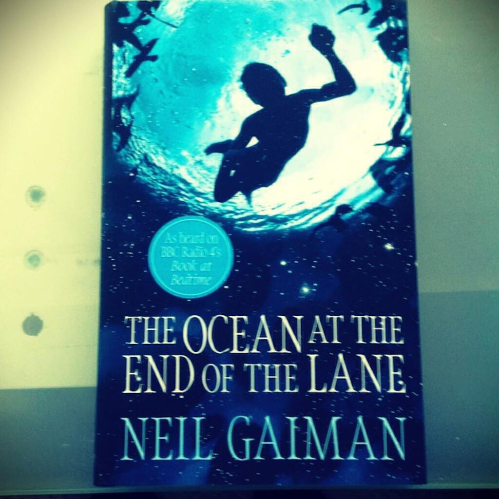

"The Ocean At The End Of The Lane" is the new novel by Neil Gaiman. I was so intrigued by it that I bought the hardcover, which is unusual for me because I prefer paperbacks. I'd been excited by [reading the first chapter online at the Guardian website](http://www.theguardian.com/books/2013/jun/10/extract-ocean-end-lane-neil-gaiman) and from reading [a blog post about the novel written by the author's wife Amanda Palmer](http://amandapalmer.net/blog/20130618/). I'd not read any of his novels before but they had long been on that "to read" list that is typically as long as your arm. I also enjoyed the movie adaptation of "Stardust" though I have no way (yet!) of knowing whether the film is as good as the original book.

I devoured "The Ocean At The End Of The Lane" over the course of a hot weekend (it was the book that I was reading on the balcony [in this post](from-the-balcony)). Though it is very easy to read, it is definitely a book for adults about adults despite the focus of the story being very much on children and childhood. Its main theme (to me) is that of how adults remember childhood and how the events we do not fully understand as children continue to resonate into our adult lives.

I'm determined not to spoil the plot so I will only say that it involves an ocean at the end of a lane. You might want to think about how an ocean might be at the end of a lane. You might in fact think of a small puddle or very small lake - and you'd be correct. So how can a small body of water like that be an ocean? Well, if you're guessing that magic is somehow involved then you're on the right track.

The magical elements of the plot are surreal and wonderful, and yet also functional - with their own consistent internal logic. There are some delightful and diabolical characters and some downright scary moments - ones that I imagine might particularly challenge the parents amongst the book's readers: when is your father actually not your father? Also reading chapter X during a thunderstorm will either be a peak experience or is not at all to be recommended, depending on your disposition!

The story ends with the narrative having gone full circle (sorry but no spoilers!) and this mimics not only the circular shape of the titular pond-cum-ocean but also of the act of picking up a storybook and immersing yourself in the tale within. In this way the reader is drawn into the story very much in the same way as the narrator is drawn in to his memories. It is this mirroring that makes reading the novel such a satisfactory experience.

Our memories form a significant part of who we are. And of course our childhood is when much of identities are created both by us and for us, by own experiences and by the actions of others. Thinking more about just how powerful memory is - just how amazing it can be when we recall every detail of a peak experience, the terror when that capability begins to fade away - and how serendipitous the biology of it is, just blows my mind. The greater part of what we consider to be our self is in fact centred on electric sparks firing across a web of neurons.

Everything that we have experienced or ever will experience, everything that forms us and changes us, is all down to the movement of ions between membranes in the buckets of goo that are our skulls. That's why I have no problem with stories that involve magic: every single memory I have, every single sensation I experience (at the moment, mostly the annoyance of typing all of this out wrong), every sensory pleasure might as well be magic for all that we truly understand it.

I hope you will forgive that rather strange digression! As with most books that I decide to write about on this blog, I am really enthusiastic about "The Ocean At The End Of The Lane" and I hope that you will read it too. If you have read it, I would to read about your impression of it in the comments. Also, please comment if you have something cool to tell me about the biology or neuroscience (neurobiology perhaps?!) of memory - I'd love to learn more! Finally, which Neil Gaiman novel should I try next?

Photo by <a style="background-color:black;color:white;text-decoration:none;padding:4px 6px;font-family:-apple-system, BlinkMacSystemFont, &quot;San Francisco&quot;, &quot;Helvetica Neue&quot;, Helvetica, Ubuntu, Roboto, Noto, &quot;Segoe UI&quot;, Arial, sans-serif;font-size:12px;font-weight:bold;line-height:1.2;display:inline-block;border-radius:3px" href="https://unsplash.com/@formes?utm_medium=referral&amp;utm_campaign=photographer-credit&amp;utm_content=creditBadge" target="_blank" rel="noopener noreferrer" title="Download free do whatever you want high-resolution photos from Gemma Coll Malé"><svg xmlns="http://www.w3.org/2000/svg" style="height:12px;width:auto;position:relative;vertical-align:middle;top:-2px;fill:white" viewBox="0 0 32 32"><title>unsplash-logo</title><path d="M10 9V0h12v9H10zm12 5h10v18H0V14h10v9h12v-9z"></path></svg>Gemma Coll Malé</a> on Unsplash.
