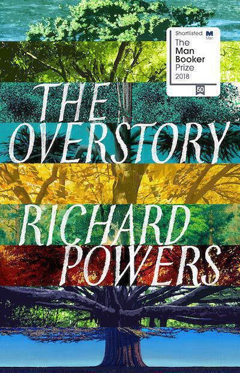

"The Overstory" by Richard Powers piqued my interest among the novels shortlisted for the Booker Prize. And [once again](satin-island-tom-mccarthy-review) the book that interested me most did not win. One year I will succeed in my prediction!

I found "The Overstory" an enjoyable read. Its accessibility surprised me. Often people view Booker nominated novels as stuffy or over-intellectual. This novel however is a genuine page turner, full of emotion and heartbreak, not to mention plenty of science and awe of the natural world. Perhaps in another year it may have won.

The story is about a set of characters all drawn together by trees. Many never meet one another, yet their stories all intersect, fusing together to form a whole. This is a lot like trees in a forest: some trees might never appear close together but the diversity of the forest enables them to influence one another.

I liked the structure of the novel. It's in four sections: seeds, roots, crown, and then more seeds. As you might guess, the story is cyclical and self-sustaining, much like a tree. In the first seeds section, Powers introduces us to his panoply of tree-related characters in vignettes. Some of these are breathtaking enough to be standalone short stories. You could read the first "seed" of the novel and leave the rest if you like. I reckon you would still have a different view on trees and humans afterwards. But why would you stop there?

And I found myself not stopping. For a week this book became my obsession. Even when not reading it, I'd think about it. I kept seeing different trees on the way to and from work, noting their shapes and leaves and seeds. Perhaps the autumnal weather enabled this: when trees are as demonstrative as they are in the waning season, you can't help but notice them. But it's also true that many of the human characters in "The Overstory" are easy to care about. I can't remember reading a novel in years whose characters affected me the way these did.

The writing is beautiful. Often clean and precise, but sometimes knotted and whorled, it picks out both a sense of wonder at nature and a bewilderment with humans. Powers shifts easily from characters to landscapes, from inner thoughts to intense conversations. Better yet is his ability to bring unusual experiences to life in your head. There's a breathtaking section atop a massive Redwood that made me feel like I was there!

I can think of only two real drawbacks to "The Overstory". The first is that plot runs out of steam toward the end. Perhaps this also mimics the life of a tree: they don't just fall down, they falter and rot and mulch and give life to other things. The plot sort of does this too: bringing forth ideas as the plot peters out. The second is that at several points in the novel, it felt like there would be a supernatural resolution. While this would be at odds with some of the precise and scientific detail, I for one would have accepted a more fantastical ending. (However, this is part of the human problem that "The Overstory" addresses: our need for fantastical solutions to real problems. We are killing the planet and there is no magic to save us from ourselves, only ourselves and the resources that remain.)

If you're in the market for an absorbing and brainy novel, with plenty of heart and character alongside, you would do well to check out "The Overstory".

---
Hero image by [Sebastian Unrau](https://unsplash.com/photos/sp-p7uuT0tw) on Unsplash.