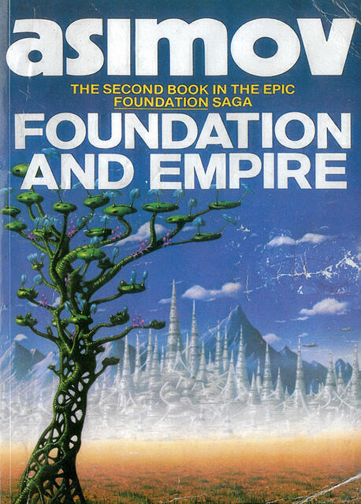

I managed to read all of the foundation novels since I [wrote about the first one](/foundation). In this post, I’ll write about the next two, which covers the original trilogy of ‘novels’ created from the original short stories. I’ve tried to avoid spoilers.

## Foundation and Empire

This is two novella length stories. The first story (“The General”) picks up from shortly after where the last of the five short stories in [Foundation](/foundation) left off. While the Foundation has expanded its influence by using its monopoly on technology to control trade, the once great Empire begins to notice. One particular person who notices is a brilliant young General who is determined to crush the Foundation and restore the former power of the Empire.

The Foundation side of the story is told from the point of view of Lathan Devers, sent by the Foundation to infiltrate Riose’s military operation, however things don’t quite go according to plan… except of course they do: the Seldon Plan takes care of events once more. There’s something of a road movie feel to this half of F&E and the writing is again the precise, well-honed text of the first book’s short stories but given freer reign in a longer format. 

Even better is the second story (“The Mule”). Up until this point Hari Seldon’s psychohistory has predicted events almost perfectly. But then a chap called the Mule shows up and planets fall under his sway one by one, even as Seldon appears to predict vastly different events. What happens when the Foundation, almost entirely driven by a quasi-religious belief in the Seldon plan, is faced with events completely outside the predictions of the plan?

The story of The Mule then is the search for a Second Foundation, a sister organisation rumoured to exist at ’Star’s End’. It’s no spoiler to say that the Second Foundation is not found in the story, there are far more profound story beats that I could give away. Needless to say, “The Mule” is a fantastic story, perhaps the making of Asimov as a writer, and definitely the making of Foundation as a series. As appealing as the concept is and the descriptions of far-off planets and spacecraft are, it’s the characters driving this story forward that make it special.

## Second Foundation

The narrative drive of “The Mule” continues into the third book. “Second Foundation”, also comprised of two novella length stories, details two searches for the mythical Second Foundation. The first by The Mule who by the opening of this book has conquered the Foundation, and the second story covers another search sometime later by the restored (first) Foundation. (Sorry, that is a bit of a spoiler, but with another four books to follow you knew that would happen didn’t you?)

They are both enjoyable stories. The Mule is a fine character but once he conquers the Foundation, he ceases to be interesting. This means that “The Search by The Mule” is the least interesting of the two: the all-powerful villain needs dispatching for the sake of making the story interesting and getting the Foundation back on track. Fortunately, Asimov learns his lesson and makes sure the Second Foundation plays a perfect game. Of course it’s done tidily, perhaps a little too tidily: a chess match in which the inevitable checkmate can be seen from a distance.

“The Search by The Foundation” on the other hand is amazing. It is the single best story in the first three books (and thus, spoiler alert, in all the books) and I really enjoyed reading it again. These days I’m a fairly slow reader but I read this story, half a paperback, in about an afternoon. I just couldn’t put it down. 

## Next time
Asimov wrote two sequels to the original trilogy in the 1980s. Because their plots move on important plot points from the original trilogy I will write about them in a separate post. After that there will be another post on the two prequels that Asimov wrote in the 1990s: these detail the events in the life of Hari Seldon prior to “The Psychohistorians”, the story that opens the first Foundation book.