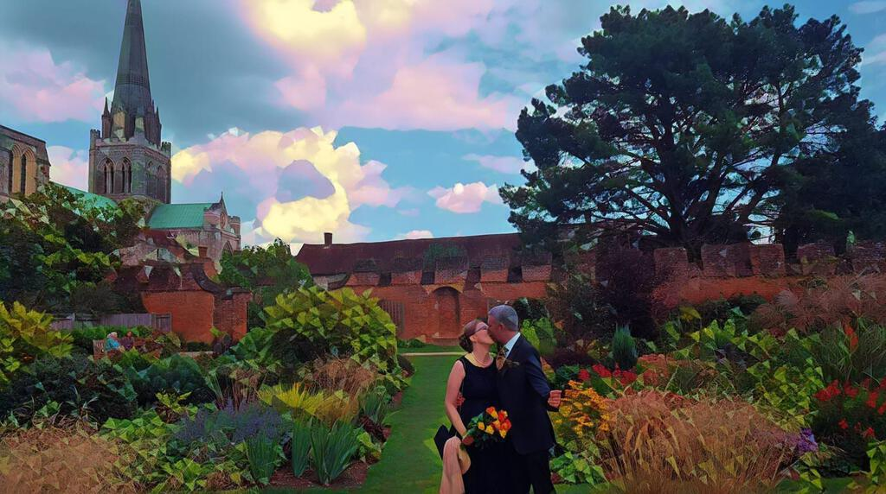

Ingrid and I got married a month ago. It was a lovely day. We had a simple ceremony with two witnesses, our friends Sue and Andrew. We kept it quiet and small, as we just wanted to be married without too much fuss. A month on, we're happy to report that we are glad we did it.

We'd like to thank everyone who nonetheless sent cards and gifts, and to all of those who wished us well on Facebook. Much as I'm wary of social networks this did seem to be one of those events to which an announcement on Facebook was well suited. We intend to have additional celebrations at some point in the near future so keep your eyes peeled. We're aware that our little dyad cannot be the only point where our families intersect. We hope to overcome that, but it is those sorts of complications that drove us to a smaller scale event in the first place[^1].

Our marriage, like most, is an affirmation of the fact we get along well. We're a team that enjoys life together in the ways that suit us best. So when people ask how married life is, I say that it is wonderful. Not in a sarcastic way, but simply because it was wonderful to share my life with Ingrid before we got 'hitched'. So it feels the same. The same, but different.

[^1]: I'm very keen on the 'win the lottery and hire a few private jets' approach but they keep selling me faulty tickets.