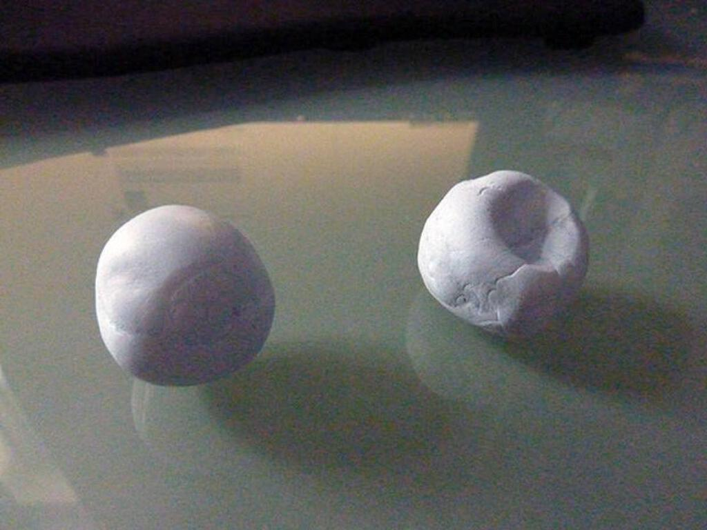

Since the run there has been a bit of a hiatus in this blog. I wrote about how running was making me feel better. In fact, I should have said more. I recently stopped taking the antidepressants that I had been taking for eighteen months. This has been my longest period taking such medication but the running made me feel sufficiently good to decide that I could stop taking them.

It was not easy at first. In fact, after the first two weeks I went back to my GP to complain about being anxious and unable to sleep. It seemed weird to not be able to sleep at that time given how tiring my running schedule had become by that point. I was told that I should persevere because being better without the medication would be better than feeling better on the medication. I believed him and was grateful for the advice.

## You do it to yourself, just you

Unfortunately, since the run I have suffered a bit of a setback. I decided to try and write about it here in order to explain what has been going on in my head and how I have been feeling. I freely admit that the person I most want to explain all of this to is myself.

Compared to previous experiences, this time it has been a minor experience - I would guess that many people may not have noticed at all but it has been quite bad from the inside. Not as bad as when I was first diagnosed, back then there were mornings when I couldn’t get out of bed. My experience has been one of a marked absence of pleasure: no enjoyment of food, no libido, too much swearing, inability to relax, dark thoughts. The experience of listlessness has been particularly frustrating. For example, I might think up an idea for a blog post and then find that an hour has passed with not so much as a pencil lifted or a character typed. My thoughts have felt very disconnected from my actions.

I have a visual metaphor for depression, the two balls of blu-tak in the photo below. They are meant to be identical but blu-tak turns out to be less malleable than plasticine or modelling clay. That’s ok though, we are all different after all. Well, there is one more obvious difference between the two balls: one has a depression. It looks glib on the surface but I do not mean that the depression in the ball is meant to describe depression, rather the feeling of external deformation of what might be perceived to be normal. Some people have it worse: they don’t have the reference point, just the feeling.

## Ahhh, look at all the lonely people

Hopefully within the next few days I will finish watching [“Moon”](http://www.imdb.com/title/tt1182345/) and [“A Single Man”](http://www.imdb.com/title/tt1315981/), two films that I bought last weekend and realised would make a good entry in my somewhat neglected great movie double bills series. When that article is live, you will be able to reach it here.

I do not want to say too much about the two films now as I will end up making that future post redundant. However, I did find it amusing to ponder how out of all the DVDs in HMV Oxford Street, I managed to pick out two about men experiencing difficulties due to loneliness. I guess it says something for my state of mind: perhaps even that it is improving slightly if I am willing to explore these things. I am yet to watch either film so I may be a bit wrong about their intent, especially as trailers seem to be increasingly deceptive these days about the nature of the films they are advertising. Full disclosure, I started watching “Moon” on Saturday night and got a bit creeped out by the first twenty minutes, not uncomfortable just scared!

Loneliness seems to be a particular fetish of mine. Or rather a fetish of my depression, which I tend to regard as another part of me, some other creature. I’m rarely alone (in London, how could you be?) but I often feel lonely (in London, how could you not be?). There are many times when I feel like a cipher, as though I am a token presence that the world can live without. I hope that this is not the case but I don’t really have any evidence to rule it out. It is my own fault really, I still can’t help but withdraw in situations where I feel uncomfortable or out of my depth and that tends to include a lot of personal and professional situations. I am often painfully slow or overly hasty in attempting to express myself. Even in intimate relationships and friendships, I have found myself feeling isolated.

The good thing is that I often have more people to talk to these days and I do tend to find that when I discuss these sorts of feelings with people, a lot of them feel the same way though perhaps they are better apt to dealing with them or they project that better at least. I am very grateful for this. At a time of greater difficulty back in St Albans, I did tend to find myself sealed off from friends and colleagues in London. Now that I have two exceedingly nice flatmates, I don’t have this problem so much. It is not that our living room is a seething confessional in which the world is put to rights, it can just be a haven of crap TV of an evening! I’m very lucky, even if I have ended up watching far too much X Factor this year.

## Despite all my rage I am still just a rat in a cage

Despite not being very emotionally articulate, I am learning more about myself as I get older. I am learning that it is better to not hold on to negative emotions and self-perceptions if you can help it. This is not the same as a sunny mantra of “accentuate the positive” as we obviously need to be aware of when things are going wrong: there’s no point looking on the bright side about bugs in your computer program, you need to be annoyed that they are there until they are gone! Likewise, I can be very prickly about criticism but I have learned that although you have to try and keep that prickliness under control (My new mantra: “Prickliness is for pricks”) you cannot throw the baby out with the bath water and not act upon what people tell you. Unless they are idiots trying to get you down of course.

I like to think of this as [attempting to live in the present moment as much as possible](http://en.wikipedia.org/wiki/Noble_Eightfold_Path#Right_mindfulness). I have been thinking a lot about how depression relates to our self-image and how it can be built up not only from our relationships to the outside world but also from things that are iterations of that relationship: not only the outside world itself but our expectations and sense of responsibility towards it. I’ll admit that with my interior life, egocentrism is never too far away. I’m acutely aware that if you filter out the common english words from this blog post, you will be left with quite a few “myself”s!

[Early (pseudo-)scientific experiments with LSD](http://en.wikipedia.org/wiki/History_of_LSD) were concerned with using the drug to take apart the self and to explore the unconscious mind, with Timothy Leary’s book about the Tibetan Book of The Dead informing John Lennon’s lyric for the acid sound painting “Tomorrow Never Knows”: “Turn off your mind, relax and float down stream”. Unfortunately the experiments of [Leary](http://en.wikipedia.org/wiki/Timothy_Leary) and his followers did not lead to new psychiatric treatments, at least not in the way that they had prophesied or hoped; the doors that opened were not ones to perception but often to madness and psychosis instead.

However, these notions of abdicating from the self were not simply posited as an excuse to take a shed load of drugs. It was a genuine attempt to find a western response to both the mysticism of the east and the role played by shamanism and vision quests in many of the aboriginal cultures of the American continent. I think the way that popular culture has incorporated “flower power” into our mythos and how we continue to regard many illicit drugs as potential avenues of personal revelation.

What I am driving at here, in an admittedly cack-handed way, is that I believe that a lot of peoples’ unhappiness - mine included - is down to the overdeveloped sense of self that seems to be required of us by the modern world. Required for what? Advertising, social status, career, fashion, capitalism… all the things that make me go “yuck!”.

All of this is based solely on my own experiences and I am not about to suggest that anyone else take all this as gospel, this is just what makes sense to me. Note the presence of the tag “Pretending I know what I’m talking about” (NB: there are no tags now that I have stopped using WordPress), it appears with some frequency on this blog. However, I think that the way forward is to journey outward into the world and engage with it. My experiences with the run are proof that it works (again, for me, I can’t generalise) and the subsequent setback afterwards indicates the need to maintain this engagement.

## There is one bird in my house

So, that’s the situation. Obviously I have to keep running but also to keep my brain flowing I have decided to take up a hobby or three. This blog gives me the opportunity to keep my hand in with the facets of web design that interest me, not to mention the chance to write. Obviously, it is much more interesting when I go out and do things worth writing about, I definitely look forward to doing that in the near future.

Back in December 2006 when my PhD was really stressing me out, I decided to make handmade Christmas cards and send them out to people I knew. There were twenty of them, each with a unique photo (there are some really good [creative commons images on flickr that are tagged with Christmas](http://www.flickr.com/search/?q=christmas&w=commons&s=int)) and a unique shorty story inside. This year I was going to expand each of those stories and write four more; unfortunately there has not been enough time so it will have to be next year, five years on. I cite those cards now, as a teaser for the creative stuff I intend to dig into in the next few months. Here’s to an end to setbacks!

(And an end to blog posts like this one, which are about miserable things and take four evenings to write!)
