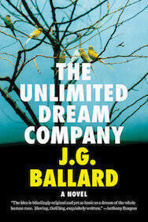

[I last wrote about a JG Ballard novel nearly three years ago](/high-rise/). That one - "High-Rise" - [has since been made into a film](https://www.theguardian.com/film/2016/mar/20/high-rise-review-ben-wheatley-jg-ballard-tom-hiddleston). The subject of this post is "The Unlimited Dream Company", my favourite among his novels: a silly romp through suburban sexual repression that glitters with sinister wit. Even after many read-throughs I still can't work out whether it is a crazy masterpiece or something light that we're meant to throw away after reading.

The novel opens with the narrator Blake telling us that he is walking alone through an abandoned [Shepperton](https://en.wikipedia.org/wiki/Shepperton). All the inhabitants have fled, replaced by large flocks of exotic birds. Blake claims that this same thing will happen all over the world, that the human colonies will be replaced by giant aviaries. The story then flashes back to one week before as Blake steals a Cessna and crashes it into the Thames near Shepperton. 

<iframe width="100%" height="300" scrolling="no" frameborder="no" allow="autoplay" src="https://w.soundcloud.com/player/?url=https%3A//api.soundcloud.com/tracks/551354163&color=%23151b08&auto_play=false&hide_related=false&show_comments=true&show_user=true&show_reposts=false&show_teaser=true&visual=true"></iframe>

"The Unlimited Dream Company" fuses the mad apocalyptic streak that runs through many of Ballard's novels like ["The Drowned World"](/the-drowned-world/) to the monomaniacal psychoses of novels like ["Concrete Island"](/concrete-island/). In many ways it is the high point of his writing, a fanciful ascent to the heights of surrealism on the thermals of his clipped, precise writing. Its plot mirrors the art of writing: Blake seeks to transform the mundane into the beautiful, ideating a new world of existence from the ruins of his own life.

At first Blake attempts to escape Shepperton (listen to the audio clip below) but is thwarted at every attempt. Busses fail to arrive, noisy traffic jams convene on the streets, and even the wildlife conspires against him. Blake begins to accept his fate and resolves to stay with the family who rescued him from the river. All the while allusions are made to a skeleton still at the controls of the downed plane.

Later chapters unfold into a bizarre psychosexual drama in which he feels attracted to almost every female he encounters, and experiences an antithetical clash of egos with almost every male. Ballard reduces his self-absorbed and preening character to that of a mere animal, one that is peacock-like in his vanity and paranoia. As all this occurs, large numbers of birds begin to arrive in the town. 

<iframe width="100%" height="300" scrolling="no" frameborder="no" allow="autoplay" src="https://w.soundcloud.com/player/?url=https%3A//api.soundcloud.com/tracks/551355168&color=%2320868a&auto_play=false&hide_related=false&show_comments=true&show_user=true&show_reposts=false&show_teaser=true&visual=true"></iframe>

As with ["Crash"](/crash/), Ballard skewers the reader's voyeurism and feeds it to a narrative that becomes more and more like a weird dream that turns bad. Whether you persevere will depend on your stomach for weirdness, but I think it's worth it. Blake is an unpleasant character with few redeeming features but I find him quite compelling. It's a character trope that Ballard has a knack for.

The novel ends up as a meditation on death and on whether or not our lives have any meaning. With the possible exception of "High-Rise", I think it addresses its subject matter better than any previous Ballard novel I have read. I'm not sure what to make of a preening and deluded self-appointed messiah absorbing the entire population of a leafy London satellite town into his body but it's a gripping read. It doesn't quite have the wry social commentary of "High-Rise" or "Crash", but it's an important exploration of surrealism nonetheless. Perhaps with the eighties approaching, culture had become so surreal that Ballard had no choice but to throw in everything he could.

He would (kind of) revisit this idea again in a short story about ten years later. "Memories of the Space Age" features a small number of delusional characters roving around a deserted Florida, fighting off escaped zoo animals and musing upon a future that has departed without them. This story has a similar feel to "The Unlimited Dream Company" and also similar subject matter to [the next novel in this sequence: "Hello America"](https://en.wikipedia.org/wiki/Hello_America).

> Already I saw us rising into the air, fathers, mothers and their children, our ascending flights swaying across the surface of the earth, benign tornados hanging from the canopy of the universe, celebrating the last marriage of the animate and the inanimate, of the living and the dead.