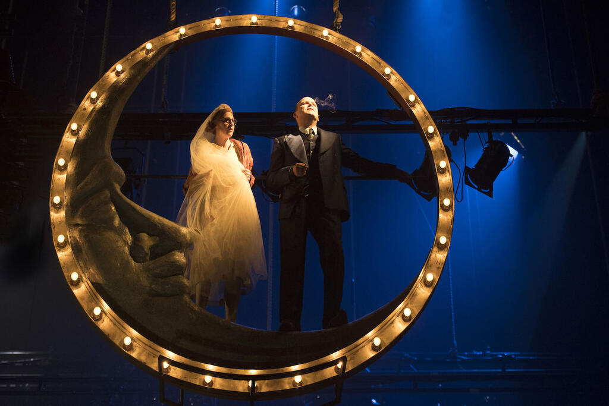
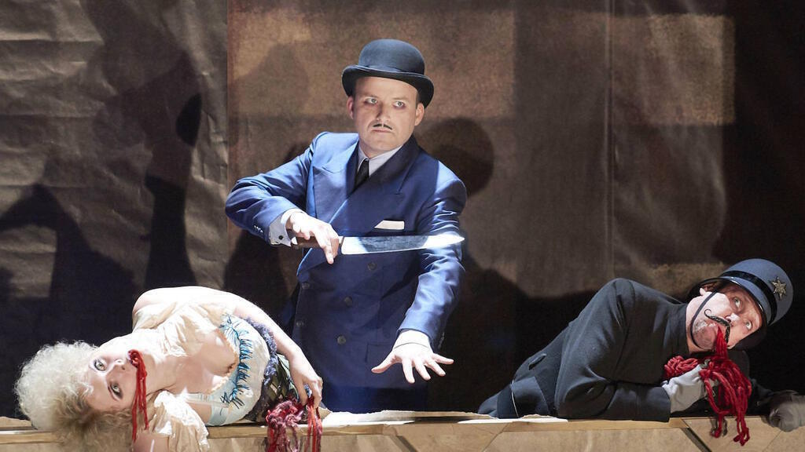

A few weeks ago, Ingrid and I went to see The Threepenny Opera at the National Theatre.

The Threepenny Opera was written by Bertolt Brecht and Kurt Weill, based on Elisabeth Hauptmann's German translation of John Gay's "A Beggar's Opera". It was first performed in Weimar Berlin in 1928 and has evolved over time through many adaptations, including several film and off-Broadway versions. It's a work with very powerful musical overtones and, despite avowals otherwise throughout by the narrator, it has a powerful moral message.

The play is set in the poorest parts of East London and is usually set in time just ahead of Queen Victoria's coronation. Drawing on Charles Booth's descriptive maps of urban poverty, it focusses on the slums and their occupants. The "vicious and semi-criminal" thieves and the whores as the black lines on Booth's maps would have it.

In particular we follow the fortunes of Macheath, formerly a captain in the army, who prowls the streets of Whitehall with his switch blade stabbing and whoring, kept out of jail by his connections to the chief of police Tiger Brown. One evening he meets and falls in love with Polly Peachum. She is the daughter of Jeremiah Peachum, the self-proclaimed king of London's Beggars and arch-enemy of Macheath. Mr Peachum engineers a trap to force Tiger Brown's hand but will Macheath hang for his crimes?

Macheath is a charismatic invention, so charismatic that his theme song ["Mack The Knife"](https://en.wikipedia.org/wiki/Mack_the_Knife) has grown into a life of its own outside of the Threepenny Opera. Many people have heard the versions by Louie Armstrong or Bobby Darrin and known little of its dark meaning or the Threepenny Opera whence it came. Simon Cowell has said that it's the best song ever written!

Other great songs abound in the show. One is ["Pirate Jenny"](https://en.wikipedia.org/wiki/Pirate_Jenny), which has a phenomenal version by Nina Simone. This song is used in various ways in different stagings of the Threepenny Opera - but always in a situation in which a female character expresses her knowledge that she'll one day revenge her oppressors. It tells of a lowly maid at an old hotel who imagines avenging herself for the contempt she endures from the townspeople. A pirate ship enters the harbour and, with its 50 cannons, flattens every building except the hotel. The pirates come ashore and kill all the townspeople by Jenny's command. Jenny then sails away with the pirates. It's a song that, when performed well, transports you to some other place entirely.

The third well-known song from the Threepenny Opera is the song that closes the second act. While popular versions of "Mack the Knife" and "Pirate Jenny" have crystallised those songs into particular forms, the second act finale still changes a lot depending on the staging of the play. It's a song in which the main characters explore their motivations, namely that it's a dog eat dog world in which a man must fight for himself in order to survive. Out of this comes a song called "What Keeps Mankind Alive?", which didn't feature in the National Theatre version, but has been covered by some of my favourite artists including Tom Waits, Mirah, and the Pet Shop Boys.

This adaptation of the Threepenny Opera is similar to others I've experienced. This was the first I'd seen live. Up until now I'd only heard off-Broadway cast recordings on Spotify and seen excerpts of incomprehensible German versions on YouTube. There are a few knowing twists (more on these below) and I imagine the language is coarser than would have featured in the first English translations.

While many productions with the content of the Threepenny Opera would play up the dramatic events like drunken vomiting and bloody stabbings, they're presented in an artificial fashion. The "vomit" is a foamy spray shot across the stage from an inartfully disguised bottle and repeated with outsize gestures for comic effect. The stabbings produce spools of red and purple wool as silly substitutes for blood and guts.

The staging was excellent. An arrangement of wooden frames covered in paper formed walls and stairs and these rotated around as a scene progressed. The paper walls meant that Mack could make some stabby entrances with his knife and other characters were able to burst through walls for extra dramatic entrances. This also meant that as the play progressed the stage began to break down, becoming as rickety as the plot and as run down as the London slums of its setting.

I enjoyed all the performances. Rory Kinnear plays Mack as a spiv, a luckless villain run aground on his own impulses, and seemed to be having a whale of a time throughout. It's not a role that needs interpretation: doing so would undermine the whole point of the show. Mack is meant to be amoral and unthinking, that's what gives the ending its power. Nick Holder was excellent as Jeremiah Peachum holding court with a camp grimness as a transvestite King of the Beggars (think of an evil Eddie Izzard). Rosalie Craig captured both the initial simpering innocence of Polly Peachum and her steely rise to crime boss, delivering some belting tunes along the way. I also enjoyed Sharon Small's performance as Jenny Diver. It coupled deft acting, great singing and some impeccable comic timing.

Overall it was very enjoyable indeed and for £15 it seemed like a steal, particularly given our seats had such a great view of the staging and the action. The adaptation played up the artifice and the fact that no moral would be applied, even though the characters express moral opinions throughout. There's a scene where a giant England flag is unfurled that seemed like a pointed remark about the toxic embrace of poverty and patriotism, but it didn't really hit home for me. But as they said, it's just entertainment: there are no morals here. Perhaps that's the point of the Threepenny Opera after all, to hold up a mirror and then laugh as you flinch from your reflection.
