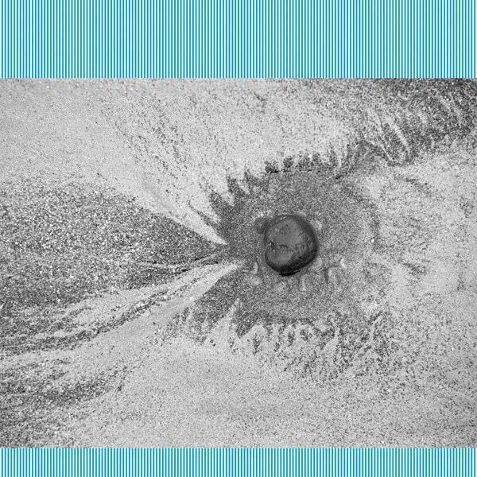

## 10. Grails "Chalice Hymnal"

Some albums are good because a band continues making the music that you love. Some albums are good because a band takes their ideas a step or two further than before. Chalice Hymnal is that rare album that does both of these things.

The references to past albums include the track Deeper Politics and Deep Snow II, and, as per albums past, these tracks evolve slowly out of languid guitar hooks and smoky atmospherics. If it ain’t broke don’t fix it.

However Grails are also a restless band as well as a restful one. The sheer number of side acts that members of the band are involved with, including Watter and Lilacs & Champagne, are testimony to that. As a result there’s also some revolution mixed in with the revolution here.

Take Tough Guy for instance. The Lilacs & Champagne project grew out of repurposing Grails tracks as instrumental hip hop. This track feeds that process back in the other direction with a swinging swagger that keeps the track in motion. As the title suggests it’s more robust than your average Grails tune.

Pelham is a noise-fest reminiscent of bands like Russian Circles. The slightly-too-long closing track After the Funeral is a reminder that while this band once named one of their albums Doommonger’s Holiday, their tongues may not have been firmly in their cheeks.

My favourite track is called Rebecca. It’s a beautiful and folky tune, the sort of thing that Grails seem able to dash off without even thinking about it. Its seemingly improvised nature gives it an emotional heft, after all it’s often more meaningful when we express emotion without intention, when we don’t even have to think about it.

To conclude this is another interesting and compelling album from Grails. It would serve as a good introduction if you’ve never heard their music before. If you have heard them before then you’ll know what to expect and I think you will like what you find.

[(February)](album-digest-february-2017)

## 9. Shinichi Atobe "From The Heart It's A Start It's A Work Of Art"

This album, which I had down for inclusion in an unwritten July album digest, it manages to create nostalgia for 90s dance music while still managing to be something novel, something creative. What you get an album of steady propulsive dance grooves and experimentation that gently passes you by. Like many of the albums on this list, it's short and to the point.

A lot of the tracks seemed to be named after songs and albums in the New Order discography, while at the same time sounding nothing like New Order. I like the contrariness of this.

## 8. Mike Oldfield "Return to Ommadawn"

"There are phrases and sections that make me shiver. Other parts will make you think of rain drops tracking their way down window panes. Others are strong and bold and confident, all shiny with winter sunshine. It’s a beautiful melancholic experience with a radiant happy ending."

[(January)](album-digest-january-2017)

## 7. Forest Swords "Compassion"

I'd looked forward to pointing out how similar and different this album was compared to Shinichi Atobe's. This album by Forest Swords also managed to dredge up comparisons to the 90s golden age of dance music. However, while Shinichi Atobe provides a glossy sleek view of that era, Forest Swords instead look at it through layers of subsequent musical styles. You can hear 90s house and techno underpinning these tracks, but they also pulse with layers of dubstep and other twitchier noisy subgenres on top. "Compassion" creates a nostalgic feeling, just as "From The Heart..." does, but it uses completely different tools in order to do so.

## 6. JFDR "Brazil"

"I really like this album. It’s short and coherent. It builds to its ending but each individual song stands alone despite being a component of a larger whole. I’d love to hear remixers get to grips with some of them. I’ll also be looking forward keenly to new songs."

[(March)](album-digest-march-2017)

## 5. Wire "Silver/Lead"

This is a solid collection of late-period Wire songs akin to "Change Becomes Us". There's your standard might-be-topical cut-up word play on songs like "Playing Up For The Fishes" and "Diamonds and Cups". But there are also songs that are topical, such as "Sleep on the Wing" and "This Time".

If there's a better love song on any of these ten albums than "Forever and a Day", I'll eat my hat.

## 4. Daniele Luppi, Parquet Courts & Karen O "Milano"

"This short album is a collaboration between composer Daniele Luppi, the New York band Parquet Courts and Yeah Yeah Yeahs singer Karen O. Luppi is a composer of film music and he’s the lead artist on Milano, a concept album about Milan in the 1980s. It’s a collection of tales about models, hustlers and artists. Adding Karen O’s voice and Luppi’s delicate arrangements to the muscle of Parquet Courts is an inspired choice. While I can’t say that the music itself evokes Milan for me, it is nonetheless an entertaining collection of songs."

[(November)](album-digest-november-2017)

## 3. Four Tet "New Energy"

"There are some really decent tracks here and I can’t wait to hear what remixers make of tracks like *Scientists* or *Lush*."

[(October)](album-digest-october-2017)

Also, in something of a crossover, Four Tet also provided a great remix of a track from album number two on this list.

## 2. Kaitlyn Aurelia Smith "The Kid"

"The overwhelming sensation on *The Kid* is joy. I love the way that *In The World, But Not Of The World* totters just at the edge of control. The way that the pulses and strange animal-like noises of *Who I Am & Why I Am Where I Am* slowly speed up as the track progresses are a delight. It’s wonderful to discover an experimental album that is so celebratory."

[(October)](album-digest-october-2017)

## 1. The Mysterons "Meandering"

This album by young Dutch band [The Mysterons](http://themysterons.nl) is, quite simply, magnificent. It's a collection of nine weird and fabulous songs, each of which is a majestic piece of story telling. The lyrics are so good I have to marvel that they're writing in their second language. Indulge me as I list a few favourites. "Metamorphosis" leans heavily on the plot of teen movie "The Faculty" and unleashes a spectaclarly creepy riff in the middle 8 at a critical point in the story. "Binary Code" might borrow some of its plot from that kooky Star Trek TNG episode "10010101" but at heart it's an anti-nuclear parable. "Turkish Delight" might simply be a song about Turkish Delight but listen again and you may find a sinister hidden meaning. Then there's the gentle ephemeral closer "Bug Powder Dust" (cool title aside, it's completely unrelated to the [Bomb The Bass track](uc14) which jinks and jitters matters to a cool close. I love this album and was tempted to instantly give it the [understated classics](understated-classics) treatment. I hope there will be many more great albums in 2018.