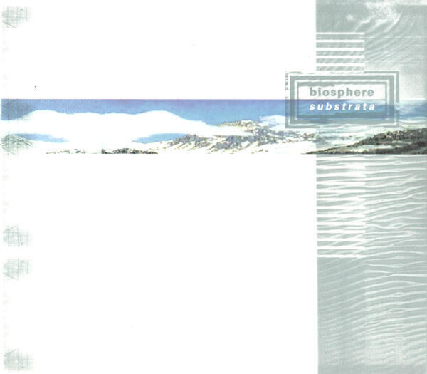
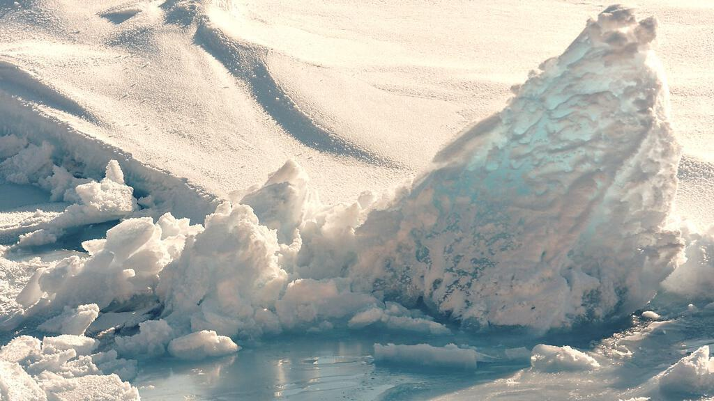
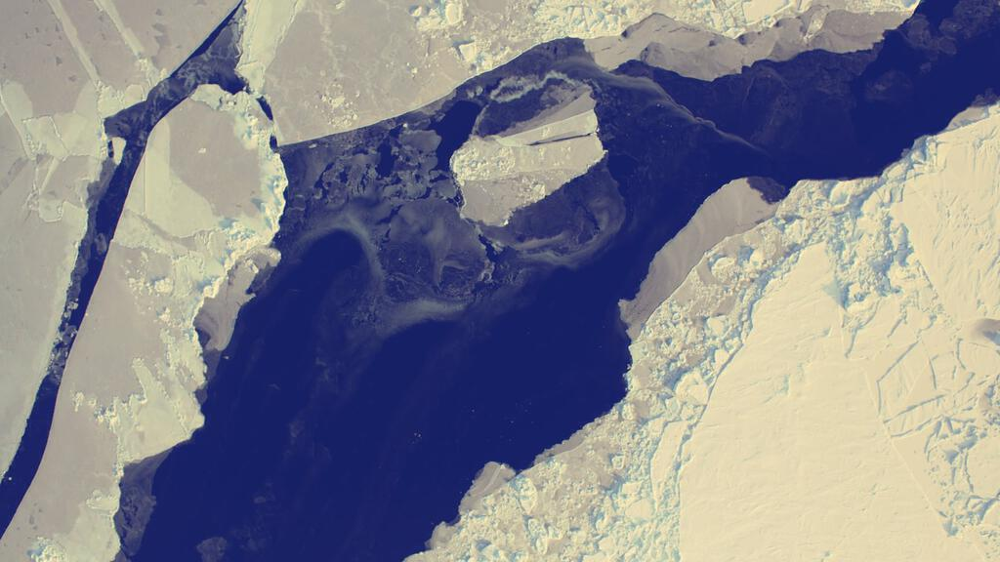

I bought this album in the summer between my two years at college. I remember listening to this music under skies glowering with clouds so 1997 must have been a poor summer. I’d just bought a book of photography too, which placed photos from the north and south poles on opposite pages. I bought it mainly for the penguins that were, of course, on pretty much every other page. The pictures of snow and ice soon became the ideal companions to this album.

In 1997, I was still finding my feet in terms of taste, so when I bought Substrata I knew that it would be aligned to my emerging thirst for all things ambient and electronic, but it was nonetheless something of a risk. This was before you could stream something off the internet, a time when you bought music out of curiosity because you thought you might like it, not out of guilt after you’ve pirated it because it turns out that you do.

I think with Substrata I had a good hunch. I grew to like it more and more as time went on. It is a splendid ambient album that, as you can infer from the pictures of icy mountain ranges plastered all over this post, has a distinctly Arctic theme[^1]. It contains some lovely found sound too. I am a big fan of ambient music, but I find that found sound rarely works for me. I think that Substrata is the exception that proves my rule. I think that found sound tends to tip ambient music into somewhere a bit cheesy, into something not unlike those CDs of babbling brooks or jungle atmospheres that gather dust at the checkouts of health food stores.

## Beyond found sound

Mentioning found sound helps in the discussion of the music on the album, because it is only with the waterfall sound (anywhere else this would be cheesy) at the start of the third track “Chukhung” that you realise that something interesting is happening. The first two tracks set the scene with basic soundtrack work and lift-off is only happens once “Chukhung” starts to establish the mood: and I mean real, emotional mood. It’s not just glaciers and ice, polar bears and fir trees: you get a real sensation of being out in the wintry wastes and permanent darkness north of the Arctic circle.

It is largely foreboding and darkness that looms over the initial tracks: “Chukhung” evolves over a strange corkscrew rhythm that seems to suggest looming grey clouds pregnant with snow; “The Things I Tell You” iterates over a sparse synth line that seems to emulate a mountain ridge, alternately bathed in light and obscured by mist; “Times When I Know You’ll Be Sad” seems to be a paean to seasonal affective disorder, though with jokey vocals and tongue firmly in cheek. The latter is perhaps the closest that Substrata gets to a song, but this is definitely an album of moods and impressions rather than a collection of songs.

Throughout the album, tracks are built upon synth lines that pan left to right and back again, creating the impression of large flat circular landscapes. This minimalism is perfect for evoking polar scenery in the mind’s eye - one definitely imagines snowy wastes, ice sheets and dark pine forests, even if these are somewhat stereotypical ‘film stock’ images.

## The icy heart of Substrata

At the heart of Substrata are two tracks that rely on killer spoken word samples[^2]. Ambient music can often stand or fall on the choice of such extracts used to set the scene. As “Substrata” is largely instrumental, the use of samples in tracks about half way through the album provides a way-point for listeners that might get lost in largely instrumental pieces - just as my younger self did.

The first sample features in the track “Hyperborea” and is from “Twin Peaks”. In it a man discusses a dream and before I looked it up on wikipedia, I was convinced that this was part of a hypnosis tape. It helps flesh out a minimal backing that, for me, evokes a pine forest: all the things described by the speaker emerge from the imaginary forest as though part of a shared dream. The second major sample underpins “Kobresia”, a track that hangs around your speakers like misty winter drizzle while a Russian psychic attempts to identify what is on a table in a room upstairs. Psychic viewing is brilliantly absurd, I remember watching a totally bat-shit movie at the Hayward gallery once in which large structures on the surface of Mars were described by such an individual. Is it delusion or simply someone with a brass neck? Who knows?

## Out into the wild white yonder

The rest of the album drifts off into the snow and ice quite beautifully, though the final track “Silene” is of particular note. Found sound appears again and the track ends with some disturbing sounds of ice being broken up, melting, and cracking. It is difficult to tell whether it is a small amount of ice breaking up with a lot of force, or a whole vista of the stuff melting and slowly cracking up without any intervention at all. Either way it is a weird and fitting end to the album, indicating the release of the listener from the album’s icy grip.

* * *

Hero image is [Artic Sky](https://flic.kr/p/5D7mY1) by [Jim](https://www.flickr.com/photos/alphageek/), ([cc-by-nc-sa](https://creativecommons.org/licenses/by-nc-sa/2.0/), no modifications made). The first additonal image is the album’s cover (fair use). The second image is [Arctic Ice](https://flic.kr/p/7EbJXP) by the [U.S. Geological Survey](https://www.flickr.com/photos/usgeologicalsurvey/), ([cc-generic,](https://creativecommons.org/licenses/by/2.0/) cropped to 16:9 ratio and a filter applied). The final image is [Arctic Ice Sea Lead](https://flic.kr/p/cZJZGo) by [NASA Goddard Space Flight Center](https://www.flickr.com/photos/gsfc/), (also [cc-generic,](https://creativecommons.org/licenses/by/2.0/) cropped to 16:9 ratio and a filter applied).

[^1]: So, alas, no penguins!
[^2]: I suppose I am distinguishing between found sound and vocal samples here. Perhaps there is very little difference, or that one is the other? When is a vocal snippet something more than found sound? Is it the fact that one has meaning? Isn’t a “meaningless” sample - like the ones here in Russian that I can’t understand - little more than found sound anyway?
