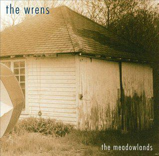

One of the first lines of "The House That Guilt Built", the soft cricket-laden lament that opens The Meadowlands by The Wrens, is "I'm nowhere near where I thought I'd be". The last line of the whole album is "this is not what you had planned". These bookending lines set the tone for this shimmering, ramshackle masterpiece - a fatigue and careworn pride in failing to meet impossible standards writ large over its first and last eighty or so seconds. "The Meadowlands" is probably the best record you've never heard, and once you have heard it, you will never be the same. Even better, it changes and you change with every single listen. If you're living your life and you really mean it, then this is the record for you.

And what makes a masterpiece? Well for a rock album you want great songs that mean something and stand out as works of art. You need something recognisable and yet still fresh and distinctive. You need those songs to be sung with a voice that moves you, that you recognise as your own. And you need at least some of those songs to really rock out. On "The Meadowlands" The Wrens deliver all of this in spades. Take second song "Happy" which moves through about three movements in its five and half minute run time - from stoner groove to a pogoing riff, tracking the course of a relationship from doting courtship to bitter ever-after.

The next track "She Sends Kisses" is even better. It starts by picking through biographical detail over reedy sounding accordion before building in to a weary chorus, before doing the same over again. The striking feature of the song is how much the riffs and the counterpoint in the melodies do as much work for the song as the lyrics do, particularly in the gentle final minute or so.

Having hit upon the Beach Boys style vocal take offs for "This Boy Is Exhausted" another band might have really pushed idea but instead it's pushed to the margins and it's actually the beautiful walking bass line that provides the connecting tissue between verse and chorus that is the real jewel of the song. It's a great song that you can sing along to but if you listen closely you'll hear that it's immaculately constructed, almost built for that serotonin hit of totally understanding, but not quite being able to sing along to, the chorus.

The same goes for "Hopeless", though in this case you'll be excused for simply being blown away by the excellent lyrics and the raw emotion on display. The guitar solo before the chorus is amazing but you're more likely to remember the lyrics that follow: "Go find someone who wants you / Someone to pray to, get on your knees to / Lay down and please you too / It just won't be who's there again" and "Go thank yourself for nothing / It's really all you're good for". The song is over six minutes long but it flies by.

"Faster Gun" is perhaps the first filler song, a punky stomp. Then a ballad, "Thirteen Grand", comes along - all Elliott Smith style vocals, along with piano and strings. It's mellower than anything else on the album, a pean to the dumb luck of falling in love. The chorus runs "Is this real at all?" as the songs swirls on.

The noise resumes with "Boys You Won't" with a wonderful see-saw riff and a lyric that seems to echo those wonderful early Death Cab For Cutie albums: "I'm feeling down, but I stood up / Dead above the ground, but I stood up". Again the production is perfect, this song is a perfect example of how to play a great lyric against a fantastic guitar riff. It's almost the perfect rock song. The next song "Ex-Girl Collection" manages to repeat the trick too, with [some amazing lyrics that you just have to read](http://www.wrens.com/records/the_meadowlands#exgirl).

I love "Per Second Second", a bouncy throw away number with a chunky riff - the type of song you don't have to think of a reason for liking other than for the fact that you can hum along to the guitar riff and jabber with the nonsensical lyrics. In fact, it's like a R.E.M.-indebted slower cousin of Blur's "Song 2". It lurches into the de facto title track "Everyone Chooses Sides" which also has one of those wonderful scuzzed out glam rock riffs, but the lyrics are about tough times and are delivered, as throughout, with a searing mix of integrity and pain. I think the key line is "I’ve walked away from more than you imagine and I sleep just fine" but it all goes by so fast it's hard to tell.

Things slow down with "13 Months in 6 Minutes" - a heartbreaking six minutes that discusses an early twenties relationship that lasts just the titular thirteen months. There's something universal about the story here, at least for those of us who weren't married off by the end of our twenties. The last line is devastating but most of us have been there: "I knew we’d never write (somehow that seemed all right) but this counts as calling three years out." The lyric plays out in half the run time and the rest feels like a little jam until there's a little revelation at the end as the song fades out: "maybe that's enough" - perhaps the joy of looking back at the same situation later.

The album proper[^1] ends with "This is not what you had planned", a little ballad that begins with a clearing of the throat and then some very heartfelt near-screaming of the line "Don't you even know what's right?" and then the words of the title. It's understated, and even a bit like an afterthought.

The Meadowlands by The Wrens is a masterpiece. You can live in it like your favourite movie or favourite novel. The songs are treacherous and change meaning with your mood and the mood of others in your life. It's depressing and celebratory. It moves your body and your mind. It's brilliant and you need it in your life.

[^1]: Yeah there are bonus tracks. Ugh.
