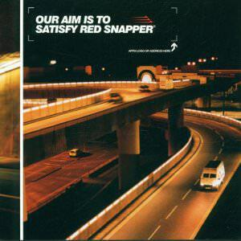

The thirtieth understated classic is by a band named after a fish. There isn't a great deal for me to say about "Our Aim Is To Satisfy"[^1] apart from the usual insistence that it is quite good. There's no overarching theme to write about, and no deep personal story attached. It was bound to happen eventually.

"Our Aim Is To Satisfy" is one of those albums spawned in the late nineties and early naughties at the height of the Electronica boom: dance music that you didn't necessarily have to dance to. It's not quite chill out music but nor is it song-based (for the most part) - it's mainly instrumental electronic music.

What set Red Snapper apart was an insistence on live percussion. This must have made them quite a compelling proposition live, which must be why the ended up supporting The Prodigy during their tours of "The Fat of The Land". On record I'm not sure that it translates the same way - many of the drum tracks and bass lines are chopped up, messed up, and mucked around with, so I'm not sure how to interpret their "liveness". Perhaps it explains why "Our Aim Is To Satisfy" is so darn funky.

I'm not going to trawl through the track list the way I usually do. As I said, there's no central theme - "Our Aim Is To Satisfy" is just a bunch of tracks really. Some of it sags in the middle and some of it misfires altogether in fact, but the good stuff is very good - and that carries the day.

The opener "Keeping Pigs Together" is a tense and atmospheric opener - as good as anything on DJ Shadow's "Endtroducing". Here it's not just the live drumming that intrigues, it's the texture of the track - it pops and crackles, seemingly caught between nostalgia and propulsion toward the future.

Third track "Shellback" is built around both a cooing vocal line (which I've always thought is about a cat) and a snippet of studio dialogue. Studio banter doesn't always make for great records - there are a million hip-hop skits that prove this - but it works here. The reason might be the way that it cuts through the pretence that vocals are anything other than another instrument. Meanwhile the backing track is awesome, a plangent stomper - more texture. The watchword on "Our Aim Is To Satisfy" is texture.

I love the way that "The Rake" opens with a rap that sounds like it's being performed by a smurf with bronchitis. It doesn't mean anything and it shifts the attention to the sprightly live percussion (OK when you pay attention the difference is obvious). I also really like the needle in the similarly smurf-like sample that demands "Come on! What's the name?!" over and over throughout.

Built on a similar idea, but less successfully, is "The Rough and The Quick". It sets a frenetic backing to a vocal about various "top shelf" fantasies - I don't think it works at all. To my mind, the repetition and harshness of the drum loops doesn't come over sexy enough - and the lyrics are just a little too gauche for me.

"Bussing" and "I Stole Your Car" are pretty anonymous, though the latter is still better than most of the tracks on Massive Attack's recent "Heligoland". The last three tracks are amazing, and are the ones that really do it for me. A downtempo suite of breathtaking beauty, they culminate in "They're Hanging Me Tonight" - a track that I often include in my playlists - I particularly like the dying feedback and fake CD skips towards the end (or was that in the mp3s from my CD copy? - they don't seem to be there on Spotify...).

Red Snapper aim to satisfy and they generally do on this album, which grafts live instruments and electronics in impressive fashion. Largely enjoyable and easy to get immersed in, it has me coming back to it time and time again. Be sure to check it out.

[^1]: A note on the name of the album, some sources refer to is as "Our Aim Is To Satisfy Red Snapper". Personally I think this is ridiculous. ↩
