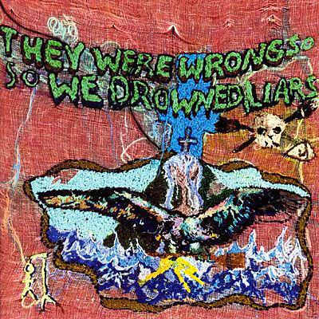

As it is Halloween, I'm writing about a spooky understated classic. Liars' second album "They Were Wrong, So We Drowned" is a concept album about witches. It was the first of their albums that I owned having heard their name mentioned among those in the New York Post-punk revival scene at the start of the 00s.

I imagine that to most ears a first listen to "They Were Wrong, So We Drowned" sounds dreadful. I certainly thought so. It's a short album and if you plough through it there are one or two nuggets that would sound great on most albums - but a lot of it initially seems to be noise and chanting and screaming. If anyone wants to make the argument that Liars are not worth the trouble, not worth the effort to like or understand, then "They Were Wrong, So We Drowned" is the album they will use as ammunition. 

However, when I revisited "They Were Wrong, So We Drowned" over the last month or so in preparation for this post (I *do* listen to the album I'm writing about), it surprised me just how much I enjoyed listening to it. I approached it with some trepidation, and I even thought that I should perhaps write about "Drum's Not Dead" instead. However while I listened to it for the first time in years at night and on the train, I found it to be a revelation.

I think one of the reasons why I like "They Were Wrong, So We Drowned" so much more than I did back in 2003 is because I've listened to so much more music since then. I've come to love music that exists at the margin of noise and melody. I've discovered bands like CAN and Neu! who build tracks out of groove and texture. I'm much more appreciative of the effort it takes to bend songs out of typical lyrical constraints and out of conventional structure. I've listened to hell of a lot more music by Tom Waits.

Moreover, "They Were Wrong, So We Drowned" informs Liars' subsequent work: its financial flop forced them to hunker down and renovate the studio in which they'd record "Drum's Not Dead"; its weirdness gave them something to react against on their eponymous album; its structure helped them to pull off a similar feat of (more approachable) story telling on "Sisterworld"; and, of course, if you listen carefully, you can hear its influence on the simultaneously accessible and experimental aspects of last year's seventh album "Mess".

When it comes to your eperience of "They Were Wrong, So We Drowned", the good news is that it's going to take you about six minutes to work out whether you will like it. Those six minutes are the duration of the opening track "Broken Witch". It begins with some dark slurps of synth that sound almost like alarms, interupted by a burst of rattling drums redolent of those witchy stick constructions that you find in the woods (hence the cover image of this post). As the vocal enters and strikes up a spell-chant, there's a nice twisty Marc-Ribot-esque guitar line that underpins it. It all clatters along as though it will all fall to pieces at any second, held together merely by sheer force of will.

As it turns out, I imagine most people might turn off after about two and a half minutes when we get the word "blood" chanted repetitively for about thirty seconds. Remember all those supposedly satanic albums that those concerned parents wrote about to the Daily Mail? Well this is one of those. If you can handle the subject matter, including some tongue in cheek stuff about wanting to be transformed into a horse ("men have small hearts / I need a ... tail / Tell me a tale..."), then it turns into a great rave-up.

"Steam Rose From The Lifeless Cloak" is a transitional instrumental piece, one of the bits of the album that makes a lot more sense once you've heard a few albums by CAN. Meanwhile "There's Always Room On The Broom" is the one song that could have been on their first album, a post-punk retelling of an episode of "Sabrina The Teenage Witch" (no, not really). It's great and I think back in 2003 I really wanted the album to be "Broken Witch" and nine clones of this song. It's the only song on the whole album that's direct enough to merit automatic inclusion on your Halloween playlist.

The next song "If You're A Wizard Then Why Do You Wear Glasses?" (Good diss of Harry Potter guys!) is another transitional piece: it's mostly instrumental with some mumbling and some screams at the end. It's connective tissue I guess. It leads into "We Fenced Other Houses With The Bones Of Our Own" which skulks along on a beat that has all the infernal twitchiness of a steam powered ghost train. The lyrics are mostly about cauldrons and descend into more spell-like chanting. I think that what I understand now is that the entirety of "They Were Wrong, So We Drowned" is an ensemble and that individual tracks present different facets of the subject matter. 

With "They Don't Want Your Corn, They Want Your Kids" the album suddenly takes a lurch into political territory with a song about how witch hunts are designed to distract the poor from the real issues that face them. It's surprisingly accessible, perhaps helped by having about the second best arrangement on the record - a twitchy pulsating affair. It's frustrating that its momentum then gets cut away with another instrumental interlude "Read The Book That Wrote Itself", albeit one that features some superb and spooky drumming. If you fall asleep listening to this one, you will definitely end up dreaming of getting trapped in the woods.

Fortunately the political theme and the tempo return on "Hold Hands and It Will Happen Anyway". I'm not sure how I never noticed the fantastic guitar work on this song, it's fantastic: horror movie surf guitar anyone? Like "...Broom" it's a shouty track and all the more enjoyable for being one of the more structured songs on the album. The last minute or so is compelling, descending into a chant of "choke/choke/the devil we invoke".

"They Took It For The Rest Of Our Lives" maintains the tempo but returns to the clatter and clang of "Broken Witch". Imagine CAN playing live at Dracula's castle and you've got the sound and the vibe.

"They Were Wrong, So We Drowned" closes with "Flow My Tears The Spider Said" - a slow song based around a creepy organ and a lyric that recounts the themes of the album as a whole. It's a theatrical end to the album that sums the whole thing up like a Shakespearean epilogue. The organ riff spookily shimmers into a haze of reverb and gets replaced with an eerie vocal line. After a while a clank of slow percussion begins that sounds like wind chimes or the slow progress of a clock mechanism. The last sounds you hear are bird song, almost as though the night is over and the sun is rising once more. 

"They Were Wrong, So We Drowned" is not an easy album to like, let alone love. However it is completely infused with its subject matter. If it were an actor, it'd be method acting right to the end of the performance. It's dark and scary. It never breaks character. It is an album whose pleasures are many but often hidden, revealed over a longer time scale than those of more conventional albums. Why not find a copy this halloween and crank it out loud? Even if you hate it, it'll probably scare off the trick-or-treaters! 

---

Cover image is [Witch Shelter](https://flic.kr/p/vsVT2M) by [Jakob Lawitzki](https://www.flickr.com/people/132479508@N02/), [creative commons license](https://creativecommons.org/licenses/by-sa/2.0/). I cropped the image from approximately 2:1 to 16:9 and applied a stereoscopic filter to make it look extra trippy.