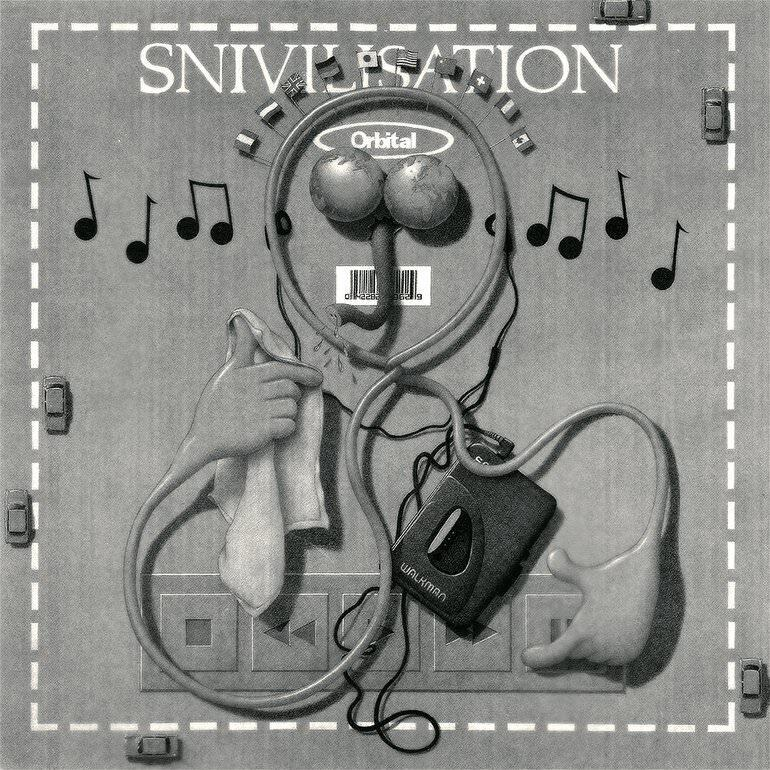
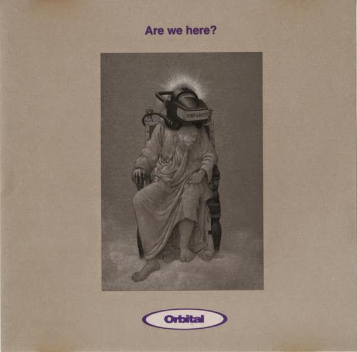

I came late to Orbital's work. I knew of them through a few remixes and because as a mad Orb fan, they could not have avoided my notice could they? Apart from that, one of my college friends tried to get me into "In Sides" just after its release in 1996. The same friend got me into ["Second Toughest In The Infants" by Underworld](uc11). I cannot now understand the reason, but "In Sides" just left me cold.

"Snivilisation" precedes "In Sides". Released in 1994, it is their third album. I got my hands on a copy about thirteen years later. Ten years ago, in 2007, I lived in a house in Bath with my landlord. One day she leaned in to the doorway of my room, listening to the music I was playing. It was [something by the Orb](uc13), or it might have been [the Shamen's "Arbor Bona Arbor Mala"](uc6), and she said "the guy who used to live here liked music like that." She explained that he left some of his CDs behind and that they were in the attic if I was interested.

Well dear reader, my reward for overcoming my immense fear of ladders was to find a stash of about 10 CDs of mid-90s dance and indie music in the attic, perched on one of the roof struts. Three of them were by Orbital ("Snivilisation", "In Sides" and "Times Fly"). I do not remember what the others were, probably stuff by the Chemical Brothers and some ropy compilations. Some of the other albums I already had, but two of the Orbital albums were new to me. I also took an interest in the Greatest Hits of the Stone Roses but the CD wouldn't rip &#xe413;.

In retrospect, "Snivilisation" is the sound of a band waiting to go mainstream: an inflection point where great tunes, command of their equipment and artistic vision all combine to produce a great album. It’s the sound of a band who had made great tunes (for example, Chime and Halcyon) putting all those elements together. For all the hair-raising catchiness of their early singles, their first two albums, both called "Orbital" but referred to by everyone as the green and brown albums, were rather scattershot affairs. By adding elements of rock music to an already heady mix of trance and techno, "Snivilisation" sees Orbital taking a massive leap forwards.

Adding rock elements (i.e. samples of guitars) to dance music happened lots in 1994. Six weeks before the release of "Snivilisation", The Prodigy released ["Music For The Jilted Generation"](http://www.bbc.co.uk/music/reviews/2bvr/), an album that also incorporated rock samples on tracks like "Voodoo People" and "Poison". The funny thing is I had a cassette copy of "Jilted Generation" soon after its release, but never heard "Snivilisation" at all. I remember hearing "Are We Here?" in the charts but, even though I loved The Orb's "Blue Room", I thought it sounded thin. I found a copy of the single online while writing this review: how wrong I was! It goes to show how the choice of singles can make or break an album.

"Snivilisation" is spiky and rude. In keeping with the time of its release it’s furious about the state of the world. The parallels between 1994 and 2017 are obvious: a country stagnating under a failing tory government and a right wing press stomping all those who oppose it into submission. The hot topic back then was the [Criminal Justice Bill](https://en.wikipedia.org/wiki/Criminal_Justice_and_Public_Order_Act_1994), which sought to prevent mass raves; something the burgeoning dance music scene saw as an attempt to curtail artistic expression. As a result the album is as much an artefact of social history as it is one of electronic music.

One thing that drew me to "Snivilisation" in 2007 was the way it explores the relationship between people and technology. The cover is a walkman distorted into a cartoon character shape over a banal grey background. The cover of the "Are We Here?" single is Jesus wearing an old-school Virtual Reality helmet. Several of the tracks are collage pieces that overlay concerns about technology with old world concerns. On "I Wish I Had Duck Feet", a carnival barker exhorts viewers to see his freak show while additional samples whisper about plastic surgery. Opener "Forever" slices and dices a rant about the inequities and iniquities of capitalism in such a way it's impossible to date the sample. Is the ranter talking about the 1990s and the 1960s, or the 1890s and the 1860s? I guess the point made is that it doesn't matter. The excellent "Philosophy by Numbers" riffs on the weird adverts you used to see for home-based learning in the early 90s. It sounds dated now though, what with the internet and everything.

"Snivilisation"'s excellent first half uses the collage tracks to augment "Crash and Carry", a raucous techno number, and "Sad But True", which is one of two tracks that feature Alison Goldfrapp. Appearances on albums by Orbital and Tricky that paved the way for the success of Goldfrapp's "Felt Mountain". In 1994 she seemed to be on almost every half decent record.

The second half of "Snivilisation" begins with "Klein Trink Wasser" which interweaves piano samples to form a wonderful meta-riff that feels like it's dropped out of a 33 1/3 RPM recording of a Mozart piece played at 45RPM. Almost three minutes in the techno begins but the tune never shakes those pianos, which come rattling in whenever things sag. At points, check out the seesawing synth line that enters at 3:58, it sounds like early Kraftwerk, which might explain the title. Next up comes "Quality Seconds"[^1], a two minute smash-and-grab that throws thrash metal shapes while also sounding like a CD skipping. To finish, we get a fifteen minute version of "Are We Here?" (more Alison Goldfrapp vocals) and the twelve and a half minute "Attached". This third of the runtime contains the nucleus of the ideas and styles that Orbital explore in their subsequent albums.

The "Are We Here?" single features four remixes of note, along with a version entitled "Criminal Justice Bill?" that is just four minutes of silence, and a radio edit. It is tempting to look at the single and its remixes as a prism splitting "Are We Here?" (and by extension "Snivilisation") into other forms it could have taken. Of particular interest is "Do They Here?", which crumples the track down into something metallic and industrial. I wrote at length about how rocky "Snivilisation" is but those elements don't appear as often as I remember. The murky industrial funk of "Do They Here?" suggests a much darker version of the album could have been on the cards. I also find it interesting that the album version of "Are We Here?" contains sections of what might be called proto-Jungle, yet these loops are not significantly developed on any of the remixes.

"Attached" floats, squelches and drifts along. On headphones, it has a strong presence, with a low synth line that pulses through most of the run time. When I played it to Ingrid through our TV the other day that same synth line seeped away and the whole track sounded different, floating somehow. I love music that changes like this and as a result, the soft throbs of "Attached" make it my favourite track.

Overall, I commend this album to your ears dear readers. It sounds both of its time and of any time. It makes time pass in unusual and interesting ways. Even now, ten years after I first heard it (and 23 years after I first should have heard it), I hear new things within it. I urge you to give it a go.

[^1]: In the 80s and 90s Quality Seconds was a cheap clothing store. Sort of like a LIDL for clothes. Quite a lot of my clothes came from there when I was a kid.