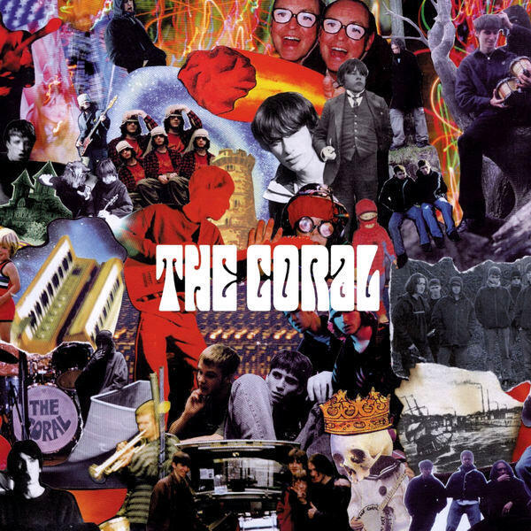

Perhaps in today's modern age of streaming and such, [The Coral](http://thecoral.co.uk) would be a bigger band and may have survived their eventual burnout. Their work ethic was evident from the start, as rumours swirled [in the NME](https://i.ebayimg.com/images/g/YdkAAOSwfl9XBSiR/s-l300.jpg) about a fantastic new band from Liverpool who were going to blow everybody's socks off. I went to see them live in Bristol after they'd released three EPs and they were incredible. Their sound, a bit like [the movie "Holy Mountain"](http://www.imdb.com/title/tt0071615/) set to pop music, imagined a Merseybeat channelled from an alternative universe in which Lennon and McCartney took their acid in [the Mojave desert](https://www.desertusa.com/mojave-desert.html) rather than in the English suburbs. Yes, it was derivative but somehow it also managed to be utterly new and compelling.

In the nascent days of the internet it was harder to find new music by bands than it is today. I remember that looking for songs by The Coral on Amazon and [Audiogalaxy](https://en.wikipedia.org/wiki/Audiogalaxy) became an obsession. Their first single "Shadows Fall" was too rare for me to find a copy. but I managed to find the MP3s and quickly got hooked. Even now copies of "Shadows Fall" go for about £30, which is a little steep for three tracks and eight minutes of music. Two songs from that EP appear on "The Coral", the title track "Shadows Fall" and "The Ballad of Simon Diamond". Both seemed to me, recovering from my first bout of depression, like glittering mirages, like songs formed from shadows and left open for the listener to fill in the gaps. "Simon Diamond", ostensibly about a man who turns himself into a tree by sheer force of will, only has about ten lines of lyrics. Even so, it manages to be about smoking too much weed, ecological angst and the Midas myth, all at once, and in just 158 seconds.

<iframe width="560" height="315" src="https://www.youtube.com/embed/kax7S_SX-qk" frameborder="0" allow="accelerometer; autoplay; encrypted-media; gyroscope; picture-in-picture" allowfullscreen></iframe>

Meanwhile "Shadows Fall" is one of my favourite songs of all time. I love its comfortable donkey-ride of a beat, the sort of swaying tune you might associate with a Western or [the theme to "Rawhide"](https://www.musicnotes.com/sheetmusic/mtd.asp?ppn=mn0106503). I also love that it is sung in a Scouse accent. It has a magnificent timelessness to it, something here and then gone, gone, gone. Just like the mysterious stranger stepping through the doors of a dusty saloon. 

 

Taking advantage of a (mostly) clear desk, I decided to photograph all my old Coral singles. All of them feature at least one non-album song, and most of them are worth listening to. Many of the singles are easy to obtain: their median price on discogs is around 50p. However, "The Oldest Path EP" is rare and goes for £12. Not as rare as "Shadows Fall" though, see note above.

The Coral's next release was "The Oldest Path EP" which is a fine collection of songs, though none appear on the first album. The title track is especially good, making its complete absence from any album or compilation mystifying. "God Knows" is a creepy ballad, the kind they'd turn to on their second album but it suffers from rather muffled production on the EP. A new version was recorded for the "Secret Kiss" single a year or two later, but by then it had become something of a dirge. The last two songs are two bedroom experiments, cute little ballads that don't really go anywhere.

Their next single "Skeleton Key" was much more muscular, the first to be recorded with producer Ian Broudie (from the [Lightning Seeds](https://en.wikipedia.org/wiki/The_Lightning_Seeds)). From this point, the arrangements of the songs became much more intricate as they began to record material for their album. Next single "Goodbye" was more mediocre lyrically but still had a catchy chorus and a fine melody. I think by this point I had seen them live [at the Louisiana in Bristol](https://www.thelouisiana.net), so I knew about many of the tracks that would come along on the album. One of these was "Dreaming of You", which, like "Shadows Fall", is one of those perfect pop songs. It's helped by that naïve bass line that opens the song, and like so many of their songs it's propelled along by harmony vocals. 

At first, the album disappointed me. I'd grown so used to picking up their songs a few at a time from singles that it seemed a lot to take in a whole album of them at once. At the same time, few of the songs that I hadn't already heard were as good as those that had been singles. Worst of all, their excellent cover of Bob Marley's "Get Up Stand Up" was relegated to a few lines of outro on a bonus track. This, along with the exclusion of "The Oldest Path", was a sore point with me for ages. However, when I came back to "The Coral" to listen to it for this post, I found all those memories rushing back and yes, if you pushed me, I'd say the selection of songs is just about right. The problem with Spotify's version of the album is the absence of the "Time Travel/Get Up, Stand Up" mashup bonus track at the end of "Calendars and Clocks".

I learned to love this album in the end and particular songs like "Shadows Fall", "Simon Diamond" and "I Remember When" have added meaning for me. I'd also recommend their third album "The Invisible Invasion", which was produced by Portishead's Geoff Barrow. I saw them live again after the release of that album, doing a warm-up for Glastonbury [at the Bath Pavilion](http://www.whatsonbath.co.uk/Theatre%20&%20Cinema/Bath%20Pavilion). By then, they had so many songs that it was like seeing an established band, not one that had only been around for four years. Crazy stuff and good days!

Photo credit: hero image by [naomi tamar on Unsplash](https://unsplash.com/photos/E1dOn4UZslI)