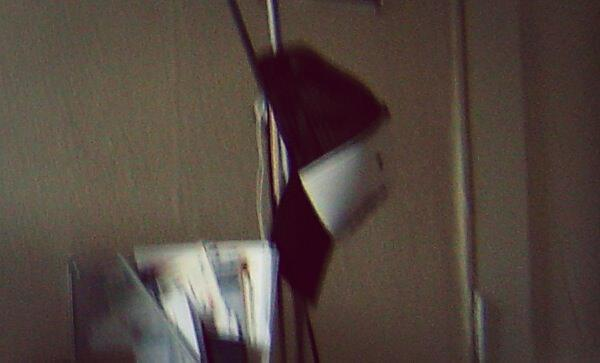

The hat in question is a Wilco baseball cap that I bought at a gig of theirs in 2004, the night that Germany got eliminated from Euro 2004. I'd love to show you a picture of it but I can't, there isn't even a picture of it from a Wilco merch site: at least not one that Google or Bing images can see anyway. I did manage to find a side-on picture of it in my bedroom in 2005 and zoom right in on it like they do in CSI.

But to start we have to go back a bit further to Easter in 2004, with everyone away from the flat where I lived. I must have been up at 5 AM to listen to a copy of Wilco’s [“A Ghost is Born"](http://en.wikipedia.org/wiki/A_Ghost_Is_Born) that I’d downloaded off the net - damn I can't even remember the name of the software but this one guy had so many cool albums - and AGIB just blew me away. A heady mix of great music and sleep deprivation no doubt.

Fast forward a few months and I'm [back in my home town](http://www.wedgewood-rooms.co.uk) enthusing to two guys from [Wilco's hometown](http://www.choosechicago.com) in the street outside of a kebab shop after the gig. I'm eating kebab shop chips and am filled with the zeal of someone who's had their artistic nipple tweaked and is talking to strangers and is wearing this totally sweet hat.

That hat, or rather the gig where I got it from, is where mattischrome was born — the new name of my alter ego — the name of my entire online identity (including this blog thanks to the nation of Montenegro) stems from the username I invented for [a Wilco message board](http://forums.viachicago.org): one that I joined so that I could download pictures of that gig (and most importantly the set list). “Hell is Chrome” is the second track on "A Ghost is Born" and it’s ace. “Matt is Chrome", given my early greying hair, seemed like a witty and sensible appropriation. Of course, it now makes everyone think that I am a [Swedish guy named Mattis](http://www.thinkbabynames.com/meaning/1/Matti) who really likes [Google's browser](https://www.google.com/chrome/browser/) (which did not exist at this time, nor did Gmail strangely enough which is why the first mattischrome account is a [Hotmail](http://mashable.com/category/hotmail/)).

The next day [England lost to Portugal on penalties](http://news.bbc.co.uk/sport1/hi/football/euro_2004/3830451.stm) in Lisbon. Within a year (three months come to think of it) I'd be in love with a Portuguese woman and in love with her culture and nation too. It feels like the majority of my life has been lived since then. Back then I couldn’t speak Portuguese which just feels weird somehow.

So whatever happened to that hat? Well it was always around, usually hanging from a tall lamp in the corner of my bedroom until the day I moved away from St Albans. That day my friend Albert helped me move out. He swiped the hat and looked better wearing it than I ever did, so I let him keep it. Perhaps he still has it.

---

Hero image is ["NINETY TWO Baseball Caps"](https://flic.kr/p/eZX3XM) by [judy_and_ed](https://www.flickr.com/photos/65924740@N00/) (via Flickr). These have been cropped down to SEVENTY TWO baseball caps and a filter has been applied. The license remains one of [creative commons attribution and share alike](https://creativecommons.org/licenses/by-nc/2.0/). I obviously took the picture of my hat, that's available on the same license.
