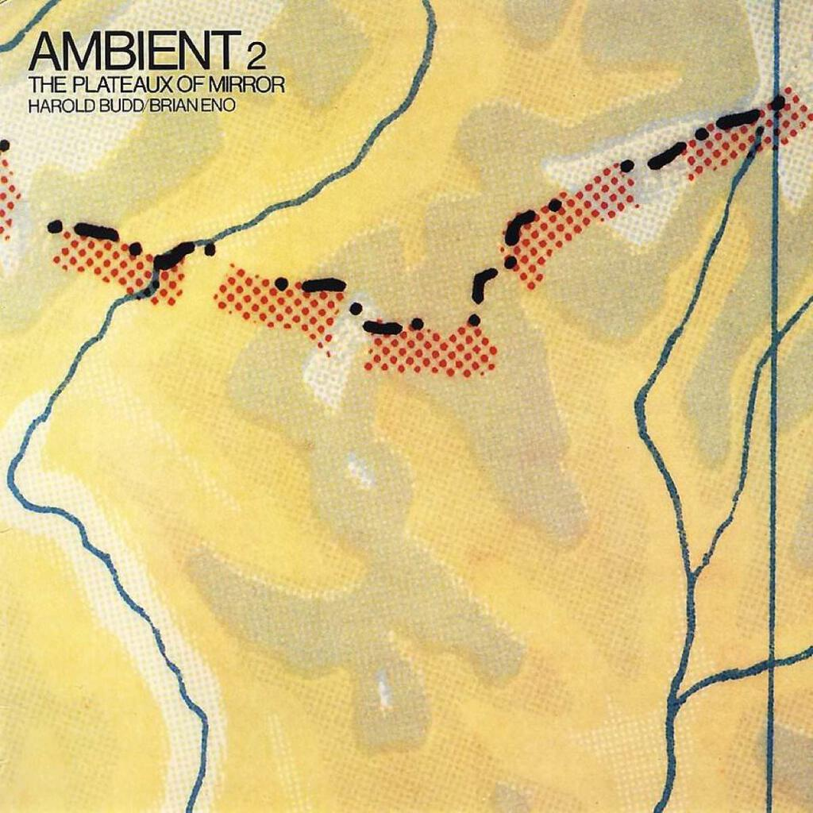
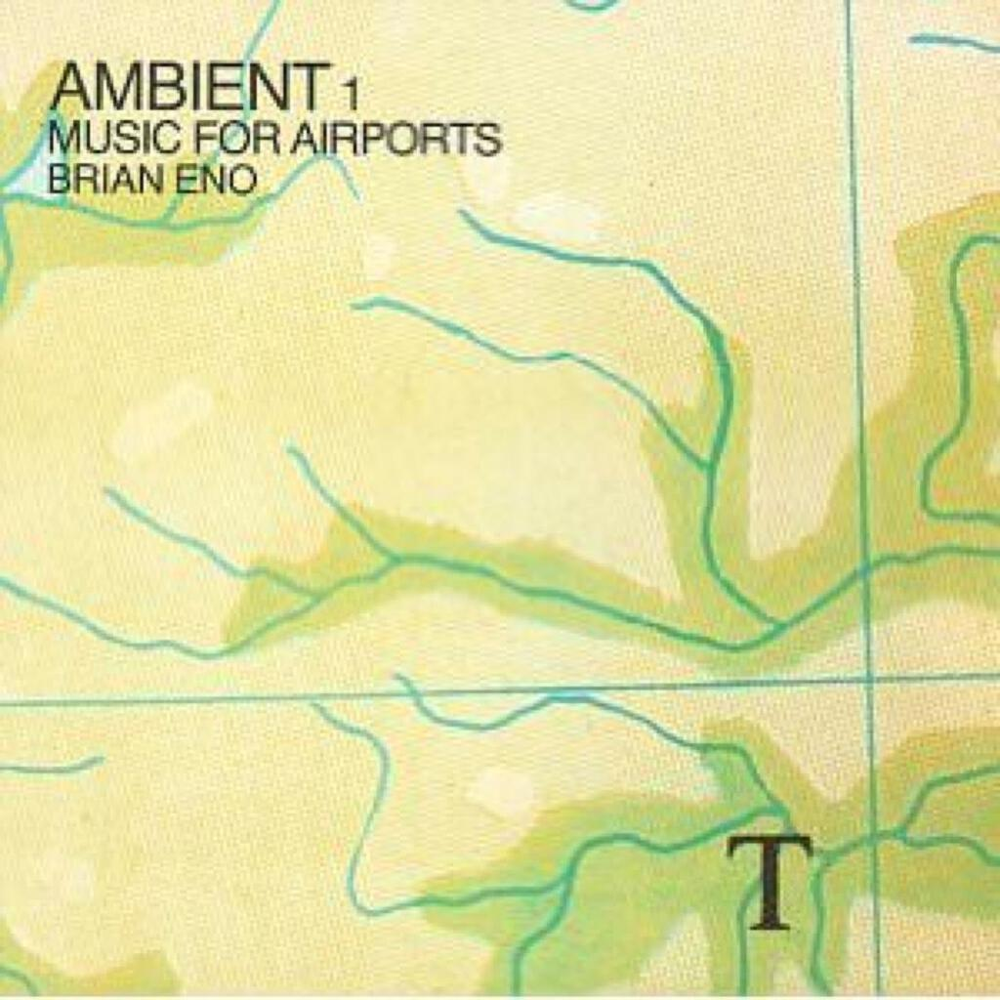
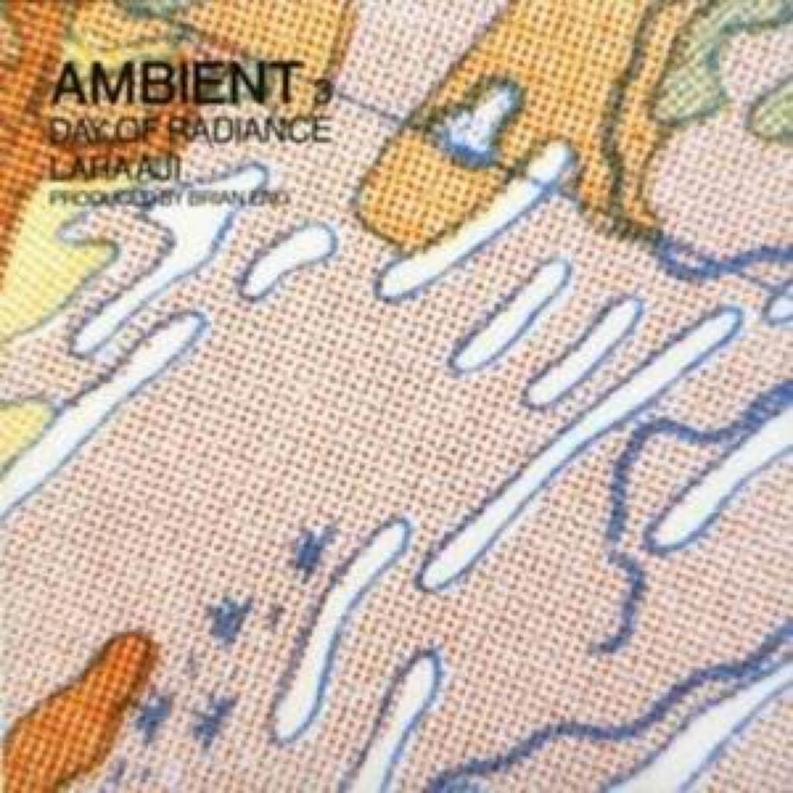
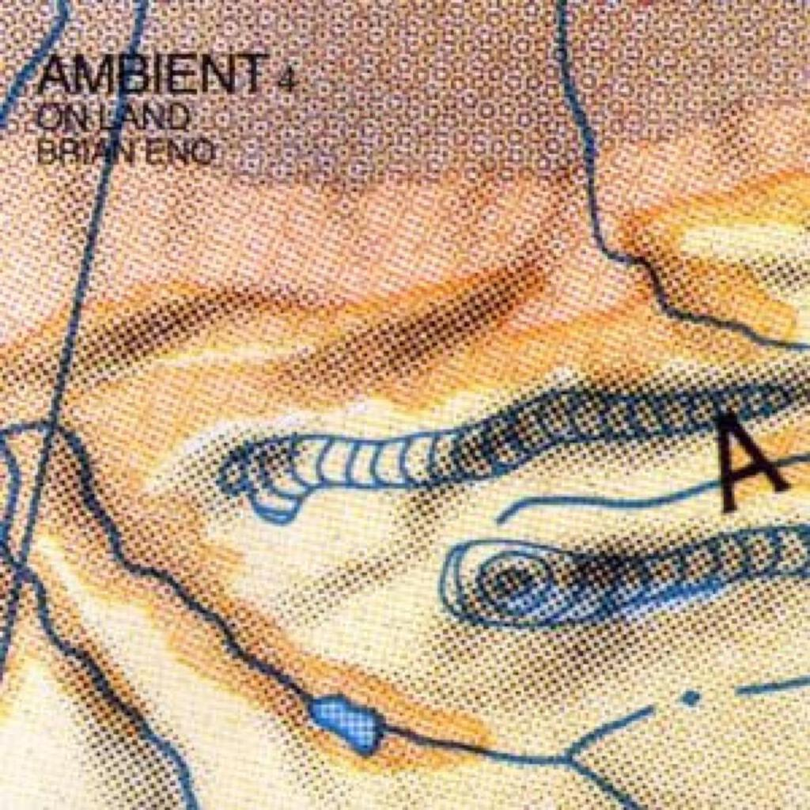

## Among Fields of Crystal / Wind in Lonely Fences

I have written about a [fair](uc4) [number of](uc6) [ambient](uc13) albums in this series (and there are at least two more to come!) but perhaps none are as unobtrusive as this one by Howard Budd and Brian Eno. It’s a subtle collection of music that sits at the margins of your consciousness: for a long time it was the music that I turned to when I could not sleep but I could just as easily imagine it as (ahem!) romantic background music as I could something to work to. I actually bought it in 2006 to listen to on an overnight flight back from the US.

The pieces are composites of Budd’s piano motifs and the electronics and drones that Eno drapes around them. These days that might lead in all sorts of directions but back in 1980 with the technology not so advanced, the intervention of the synthesizers has to be more subtle. The opening track _First Light_ is almost all piano until a small synth motif comes in at about a minute before the end.

The rest of the album does not really deviate from this template. Sometimes it is necessary for an album just to be a series of meditations where you can find your own thoughts and feelings. The music here is delicate and fragile, sometimes vanishing into moments of silence. It could almost be a soundtrack to J.G. Ballard’s [Crystal World](the-crystal-world)!

This [short article](http://en.wikipedia.org/wiki/The_Plateaux_of_Mirror) about the album from wikipedia explains a bit more about how the album came into being and a bit more about the roles of each musician in creating the finished record.

Because there is not a great deal to discuss about _The Plateaux Of Mirror_, here are some pen pictures (or pen _echoes_) of the other three entries in the _Ambient_ series. I’ll briefly mention that I considered _Small Craft On A Milk Sea_ to be [one of my favourite albums in 2010](2010-in-review) and I discussed _Drums Between The Bells_ back in [July last year](album-digest-july-2011): both are collaborations like _Ambient 2_.## Ambient 1/Music for Airports (1978)

This album was composed from piano and synth parts recorded to tapes that were then allowed to spool at random speeds. This creates the repetition of the motifs in varying and intriguing forms, producing music that is both affecting and humane - something that creates something transcendent out of the spaces between the loops.

Despite its title, this is music that you can listen to anywhere. Most recently I listened to it on a plane (and not an airport!), it was a night flight and it was the perfect soundtrack to serenely floating over the illuminated cities below. I was distraught when I had to switch off my electronic equipment for landing!

## Ambient 3/Day of Radiance (with Laraaji) (1980)

Ambient 3 is probably the least interesting of the albums as it is quite straightforward - divided into _Dance_ and _Meditation_ sections, these pieces do exactly what they say on the tin. The _Dance_ movements are animated and upbeat, while the _Meditation_ sections are slower and more elongated.

It’s not without its charms though. The fact that the dance sections are upbeat mean that they include some of the most compelling music of the series, almost going beyond the overall aesthetic and demanding your attention - the result is cascading, hypnotic and crystalline.

## Ambient 4/On Land (1982)

Ambient 4 is much darker in tone and - perhaps unsurprisingly as the last entry in the series - is the most modern sounding of all the ambient albums. Instead of slowly unfurling loops and motifs of 1 and 2 or the cascading repetitions of 3, we have layers of sounds and noise as shown from the start with _Lizard Point_. The subtitle _On Land_ is apt as throughout movement through landscape is evoked as much as the landscapes themselves. I’m pretty sure that _Tal Coat_ has been sampled on at least one track by The Orb. Pretty much every track on this album is ambient music par excellence but it is not quite as pretty as Ambient 2.

## The Series in General

[A longer article about the entire series (and beyond) from 2004](http://www.stylusmagazine.com/articles/weekly_article/brian-eno-and-the-ambient-series.htm).
