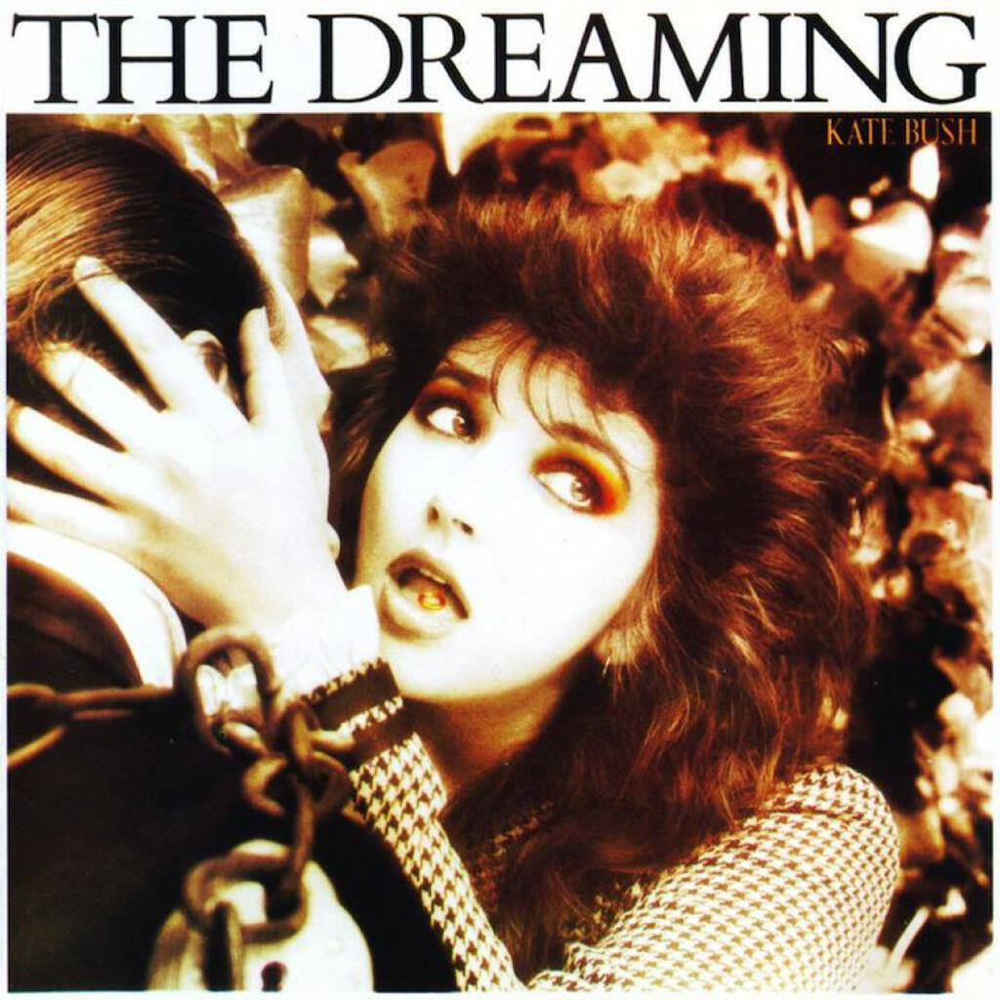

> “I see the people working and see it working for them.” (_Sat In Your Lap_)

The Dreaming by Kate Bush is a strange 1982 album that many believed had destroyed her career. Two weeks before her first ever performance of “Running Up That Hill”, [the NME had written an editorial asking whether she had burnt herself out completely](http://www.nme.com/blog/index.php?blog=10&title=on_this_day_kate_bush_releases_hounds_of_1986&more=1&c=1&tb=1&pb=1). Obviously “Running Up That Hill” (recently used to great effect in the Olympic Closing Ceremony) and the parent album “The Hounds Of Love” that followed showed that she had plenty more up her sleeve.

Nevertheless there is little doubt that back in 1982 “The Dreaming” would have sounded very bizarre indeed. There are songs about S&M, suicide bombings, stalkers, and a song about smugglers that I used to think was about [Amelia Earhart](http://en.wikipedia.org/wiki/Amelia_Earhart). One song is about the genocidal displacement of Australia's aboriginal peoples sung in an Australian accent, while another is a music hall spoof about a failed bank robbery. At first listen it is extremely strange and yet on repeat listens it is probably the best album in her discography.

Bush’s previous album “Never For Ever” contained great songs like “Army Dreamers” and “Breathing”. The latter was probably Bush’s first excursion into telling stories with music as well as sound. Apparently the recording of all the titular breathing and whooping and wheezing that closes out the song (one of my favourites) convinced the head of EMI that pornography was being recorded and he demanded an explanation! Suits huh?

The sound adventures of “Never For Ever” would continue in “The Dreaming” with Kate taking over all production duties. The results is a patchwork of styles with disembodied voices and samples and alternative vocal lines swooping all over the songs. The distinctive sound of the Fairlight synthesiser, popular and novel at the time, features throughout and while it sounds a little dated now, it colours rather than details the songs - giving them a period filter rather than a period costume.

The first track was also the first single, “Sat In Your Lap”. It is a song that I have always enjoyed, about how you approach learning new things. Specifically that tension between the pleasure of finding out new things and the time that it takes to learn. It’s something that I feel all the time. I really like the vocal arrangement in this track and the way that she sets herself up as her own back singers. The ending is typical Kate Bush but nothing like you’d find anywhere else, a weird list of directions to knowledge.

My favourite song on the album is “There Goes A Tenner”. [A post about the song on songmeanings.net makes for rather interesting reading](http://www.songmeanings.net/songs/view/54728/), I had no idea it was so subversive. Personally I don’t think that you can read that much into the song, it seems to me like a fun bit of genre imitation with a bit of a Ska and Music Hall hybrid. That said “Cloudbusting” has a really wonderfully subtext about a ‘scientist’ who believes he can create orgasms and control the weather all told from the view point of his gay son.

Next up is “Pull Out The Pin”, a song inspired by a documentary about the Vietnam war. As you might expect, it’s fairly tough going. It adds to my suspicion of whether “There Goes A Tenner” can really have such a dark subtext when it is such a throwaway arrangement. There’s some really interesting percussion in this song that subtly underlines the war theme with a hint of martiality. In the extended outro there is also a guitar line that echoes Tom Waits’ “Shore Leave” from the “Swordfishtrombones” album. I think that deep down though the subtext here is a relationship (“Just one thing in it / Me or him”) and whether to surrender one’s individuality for the sake of a partner (“…but I love life / I love life…”).

With “Suspended In Gaffa” it is my turn to find darker meanings when there probably isn’t one. The users of that  song meanings website claim that it’s about the impatience of being an artist (echoing “Sat In Your Lap” I guess) or being in purgatory (that interpretation baffles me). I think it’s about bondage, there I said it. Perhaps I am being too literal in how I understand all the lines about gaffa but also lines like “not till I am ready for you” and “can I have it all now” seem to be dripping with innuendo if you ask me… ooh Matron!

I had to sit down and specifically listen to “Leave It Open” in order to be able to write something about it. It is one of those songs on even the best of albums that just drifts by. It is about self control, in particular about whether we hurt people when it is within our capability (“Harm in us / the power to harm”) and like many of the songs on the album it takes the form of a dialogue between what are presumably different aspect of the narrator’s personality. Meanwhile from a production point of view it lays the ground for better songs like “The Big Sky” and “Mother Stands For Comfort” which would follow on the next album.

The title track, as I mentioned earlier, is sung in an Australian accent and features a didgeridoo. It’s a far better song than that (admittedly rather snarky) description would suggest though it is certainly very odd. Even against the other songs on the album it is rather strange. I like it a lot for the little Fairlight noises you can hear mingling in with all the didgeridoos and aboriginal noises, it’s a really atmospheric, almost theatrical, piece of music. It’s about aborigines being cleared out from land in Australia and it doesn’t pull any punches. It is also indicative of the burgeoning interest in what would become known as “world music” in years to come.

“The Dreaming” leads into “Night Of The Swallow” with a somewhat incongruous jig before settling into a ballad, the only one on this album. A woman pleads with her man not to go off ([smuggling, according to wikipedia](http://en.wikipedia.org/wiki/Night_of_the_Swallow_(song))) to do something dangerous as she fears for what might happen if he does. As the song ends, the jig resumes and it goes by at a fair clip for a ballad.

“All My Love” features choir voices that sound as though they have been processed through the Fairlight, creating a spooky atmosphere. A similar trick would be employed on “Snowflake”, the opening track of “50 Words For Snow”. The song has a really nice bass line that sounds like something off a Pink Floyd record and the samples of answer phone messages add to the atmosphere, it still sounds like a modern record today. You could argue that “All My Love” is the prototype for many of the songs on “The Sensual World” and “The Red Shoes”.

“Houdini” tells the story of [the famous illusionist](http://en.wikipedia.org/wiki/Harry_Houdini) from the point of view of his wife. The rather traumatic lines (“With my spit / still on your lips / you hit the water”) are delivered in a way that make the song quite challenging, it’s one of those “oh she’s bonkers” deliveries that Kate Bush got lumbered with long before Björk announced herself to the world.

According to Wikipedia, “Get Out Of My House” is based on [“The Shining”](http://www.guardian.co.uk/books/2012/jun/22/rereading-stephen-king-the-shining). I always thought it was about stalkers but “The Shining” makes more sense. It probably should have been a single because it is a wonderfully batty song and “get out of my house” is a great lyric to sing along to (better than “Bang goes another kanga on the bonnet of the van” anyway). There is yet another great vocal arrangement, the samples and backing vocals all layer over each other in ways that are both intimate and frightening. On headphones it sounds like when someone stands to close to your ear and hums something that makes your spine squirm. It must have sounded totally crazy at the start of the eighties but after “The Hounds Of Love” it would have made much more sense.

In conclusion, “The Dreaming” is a great little album (43 minutes) and while some of it sounds a little dated today, it has aged well because of the great production. I think it is the easiest album to go to listen to all the way through, though the weird “Ninth Wave” side of “The Hounds Of Love” is not without its rewards (even if it does often put me off) and there are songs on “The Dreaming” that can’t be found on “The Whole Story” which is my favourite of her compilations (it’s deleted now).