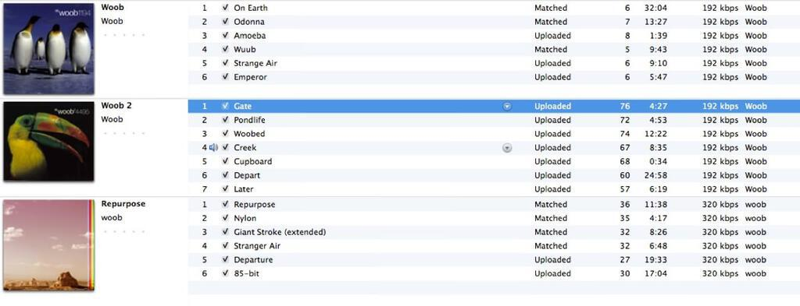

The second Woob album (AKA “Woob 4495”) is probably the greatest ambient album ever made and is certainly the best one you have never heard of. Originally released in 1995 [on the em:t label](http://www.emit.cc) it is also a rare record. I don’t have an actual copy but I have seen one! I downloaded it off the internet and even that is quite difficult to do. My friend is an avid collector of all the em:t releases and it is easy to see why: all the albums are titled in a specific way that is very appealing to people who like to collect things and they also have very striking nature photography on the covers. In a strange way, the label was able to create an identity for its releases in a way that many artists would try to.

Unfortunately the em:t label failed and it is hard to know if post-internet (things were still getting underway in the early/mid-90s) it might have had an easier time selling these albums. You can now get the first Woob album on iTunes and this second album was re-released in a remixed form as “Repurpose” back in 2010. There is a rabid second hand market for em:t records releases and “Woob 2”, sorry “Woob 4495”, is among the most sought-after.

When I listened to “Woob 2” again when I was writing this post something very obvious struck me about it. It is by far and away the most played record in my iTunes. I have played each track on the album (there are seven) between 57 and 75 times. I’ve played the 25 minute track “Depart” 60 times, which means I have spent more than a day of my life listening to just that track.

Actually there is a very good reason why I have listened to this album so many times. It’s my favourite album for falling asleep to. I appreciate that this is hardly a ringing endorsement as it is unlikely that I would continually listen to it at night if it didn’t help me drop off – and something that makes you fall asleep is not often considered as high art.

Except these are troubled times [and reports show that people are finding it increasingly difficult to sleep](http://www.guardian.co.uk/lifeandstyle/2012/aug/20/sleeping-pills-britains-hidden-addiction). I know for a fact that my post containing [five ideas to help you out when you can’t sleep](five-things-to-try-when-you-cant-sleep) is one of the most popular on the blog. Falling asleep is a big deal. In order to be able to sleep, you have to feel safe and secure, to be able to relax away from the stresses and trials of the day gone by.

As someone who cannot sleep _without_ listening to music, I can tell you that there are actually very few albums that you can fall asleep to all the time. Granted there are times that you are so knackered that anything will send you off, but then on other occasions you can actively listen to something all the way through and be wide awake at the end. It’s also true that most ambient albums try to scupper any attempts to fall asleep, either with sudden loud noises or with spooky quotes. There’s an extended sample in the first Woob album that scares me too much to listen to at night, which is why it hasn’t be played anywhere near as much as the second one.

The music itself is very straightforward ambient music. There are synths, drones, chants, tribal drums, flutes, cheesy guitar riffs, bells, chimes, and insect chirps throughout. No vocals though (those formless chants aside) and so it’s a very pure natural experience. Personally I often find myself meditating on that toucan on the cover as I listen. Moreover, if you listen to it during the day (have a cup of coffee just in case), you find that it is actually a very active and engaging album. Sure, there is plenty of noodling that you can put to the back of your mind but the drums and melodies throughout are actually quite striking and emotive when you find yourself paying attention.

This album, perhaps more than other that I have written about, epitomises the understated classic. It’s an album that you are not likely to have heard of, one that you cannot get (unless you want to take a £40 punt on a copy from eBay or go digging on useNet), one that is objectively brilliant, and one that I have a deep emotional connection to.

So what can you do if you fancy a listen? Well, if you know me you can obviously ask me for the MP3s or come over and have a listen first. Better still you could support Woob by buying “Repurpose” [from their Bandcamp website](http://woob.bandcamp.com/album/repurpose) (or you can listen to it there for free). “Repurpose” is described as a remastered “Woob 4495” with some detours and deviations, it really is just as good. Even better news (for me at least) is that there is also now a “Woob 3” (except it is called “Have Landed”) and [you can buy that from their website too](http://woob.bandcamp.com/album/have-landed). All the collectors have already been there and got the limited edition stuff, but I’m off to get a digital version right now… perhaps tonight it will be sending me to sleep!