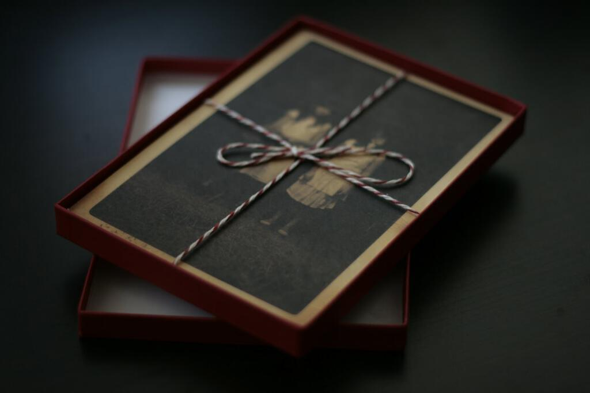
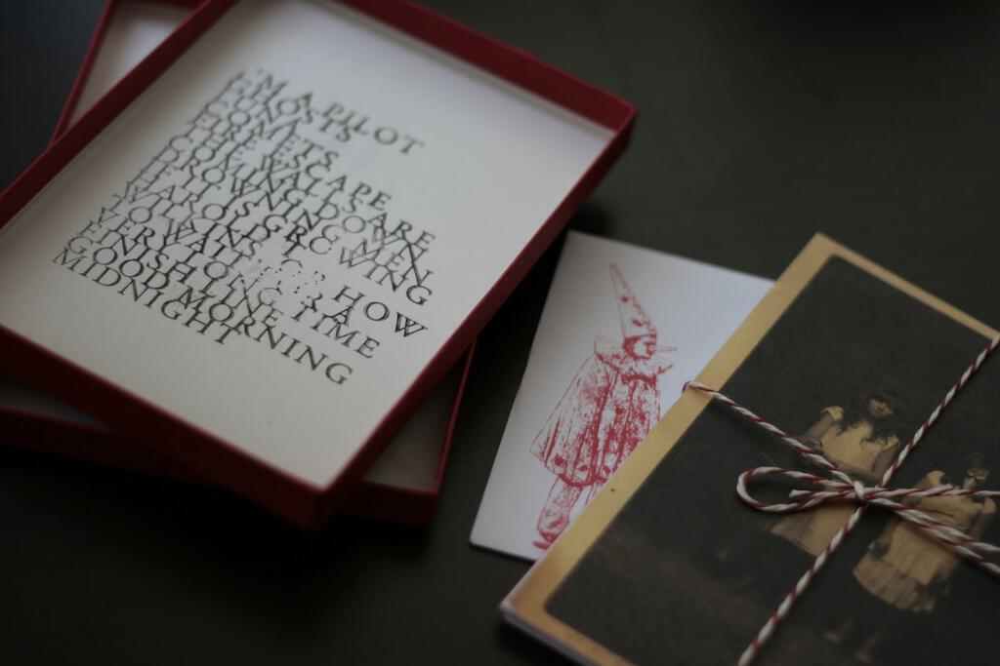

I have written a lot in these posts about how music gets indelibly tied up with places, events and feelings. For me this album by Fanfarlo is tied up with all three of these. It makes me happy and sad at the same time in memory of great times that are now gone but are fondly remembered. I am aware that this is the youngest album on the list so far and so it might be a bit early to endow classic status upon it, but "Reservoir" is a fine album and to my ears it stands up really well. Listening to it again in the course of writing this post I found that I remembered every note and musical phrase, and yet somehow I also managed to delight in hearing new features in the production that I'd not noticed before.

In January 2009, I went to see Snow Patrol at the O2 in London. Having seen Snow Patrol for the first time in Moles in Bath just as "Run" was starting to break big, the O2 was precisely the biggest absurdest to catch up with where they had got to. It was quite a hard place to be a support act there like Fanfarlo were that night, they did seem a bit lost in the cavernous space. By that point I had already fallen in love with Reservoir though, so I was able to fill in the gaps despite only knowing their songs for a couple of weeks.

People quite rightly worry about piracy and about sites like the now defunct Megaupload, but that's where I got my first copy of "Reservoir". It was my source back then for taking a punt on a support act. Later on, I purchased the limited edition box set of the album and I also paid for a digital copy (for the bonus tracks) later on too. Nowadays Spotify fulfils the same role so my conscience is a little clearer but obviously for every Fanfarlo there are bands that didn't persuade me to buy a version of their album all tied up in twine. (There's also another luxury version that features a board game which I _almost_ bought as well!)

Anyway, on to the music. Let's see if I can make a believer of you too dear reader. For ages I would tell friends that they sound like a cross between Beirut and Arcade Fire, but actually Fanfarlo are a combination of many more sources than that. Other inspirations include Bonnie Prince Billy, Tom Waits and Sigur Rós. The singles "I'm A Pilot" and "Drowning Men" are the songs most indebted to "Funeral"-era Arcade Fire, the first with its opening rolling crunch of drums forever ingrained with sunny dashes to the station in St Albans to catch the 8.33 to work.

In fact, "Reservoir" is one of my most scrobbled albums on [last.fm](http://www.last.fm/users/mattischrome/) simply because for six months it was one of the albums that most closely fitted to the duration of my commute. It's funny that I can associate some songs with the morning commute: "I'm A Pilot" and "Ghosts" are connected with the walk to the station and "Finish Line" reminds me of getting to work, while the eerie whistles at the end of "Fire Escape" and the line "trees are scratching their patterns in the sky" on "Comets" remind me of walking to Mill Hill Broadway in the twilight.

I love "Fire Escape", it's one of my favourite songs of the last five years (along with most of last month's Vampire Weekend album) and it also has a poignant video:

<iframe width="560" height="315" src="https://www.youtube.com/embed/3LKuTAjJ43Y" frameborder="0" allow="accelerometer; autoplay; encrypted-media; gyroscope; picture-in-picture" allowfullscreen></iframe>

I always think of the line "why can't he just think like us?" as being directly addressed to me. The songs that burrow the deepest within us are always the ones that we forge that relationship with. With its sing-song story and will-you-won't-you suicide vibe (underscored by the video), the song certainly became a way that I could think about and then reject the unthinkable back towards the end of 2009. Plus it's a really good tune.

Other out-and-out great songs include "Luna" (another song about secrets) and "Howard T. Wilkins, or How To Wait For A Very Long Time" with its lines "your dreams will become part of the future / and coincide with the past" -- very much the essence of my 2009 anyway. And that's not even mentioning the manic coda of "They drive the same road drifting over to your side / They drive the same road turn the lights on again / They sail the same strait turn the lights on again" that you simply have to see live! Then there's "If It Is Growing" which for me has the best lyric on the album and this lovely little piano riff that sounds (to me) a lot like the riff that gets played on the pianos in the piano store in [Betty Blue](/why-i-love-betty-blue/). I think it is about cancer but I can't be sure, and I'm less sure the more I hear it.

It seems appropriate to end with "Finish Line". Apart from the throwaway "Good Morning Midnight" (which actually closes the album), this was the song that it took me longest to love and I think things turned around when I got my box of the album because I finally got to read the lyrics. It was then that I realised how much this song resonated with me given that I had just finished my PhD. In fact, in July 2009 I did the whole cap-and-gown thing for (probably) the last time in my life. The lines "Last year was a good year, I beat myself to a bloody mess / But blue is the colour of the days I’m hoping for / What have you done to the mind you had? / Out there somewhere is the finish line" do a pretty good job of summing what it feels like to finish something massive and then have to carry on.

It's clear that "Reservoir" is deeply bound to personal events in my life and that's why it is so dear to me. Nevertheless I also think that from an objective viewpoint it is a really well made album full to the brim with great tunes and a warm-hearted sincerity. I think you would do well to entrust your memories and emotions to it too.

* * *

The excellent photos on this post are by Ben Ward. Not only does he have an [excellent taste in music](http://www.flickr.com/photos/benward/sets/72157619063911014/) but he also plays Settlers of Cataan and takes photos of bacon. The photos are creative commons licensed [(by-nc-nd)](http://creativecommons.org/licenses/by-nc-nd/2.0/deed.en_GB), which is probably the coolest thing of all.

In fact, this _will_ be the youngest album on this list. Next month I will write the 25th and last (for the time being) [Understated Classics](/tags#understated%20classics/) post.

I reviewed their second album "Rooms Filled With Light" [back in March last year](album-digest-march-2012).