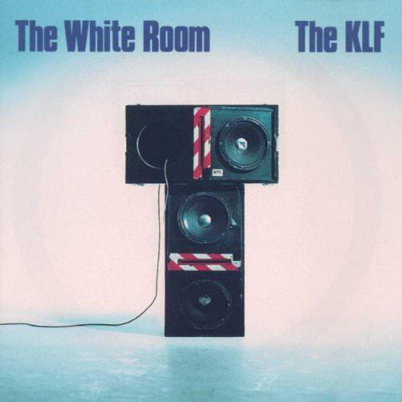
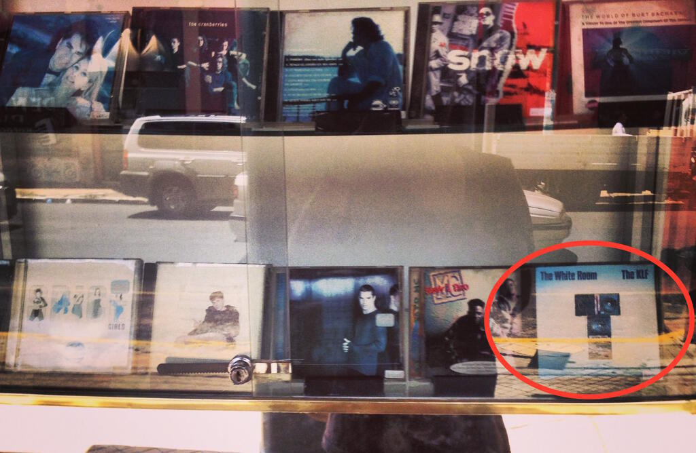

This little masterpiece was released in 1991. I got my copy on cassette for Christmas that year, but by May in 1992 they'd already "retired" and split up.

The KLF were a band in the right place at the right time with the right idea. Taking advantage of synthesizers and the idea of fusing rock and pop music with the emerging sound of house music, they laid the ground for many of the most successful electronic acts that followed them. They were also master showmen, taking a whole host of crazy conspiracy theories and smooshing them together in one stadium-sized package.

"The White Room" will be a quarter of a century old in 2016. It is a sort of Stonehenge of modern dance music: mysterious, totemic, and completely unique to the minds that conceived it. There are nine tracks and the whole thing's over and done in forty-five minutes, yet there's plenty of space and groove with two tracks making it past your standard 12" running time.

## This is Radio Freedom

The album begins with "What Time Is Love?" - the perfect example of their singles formula - a burbling synth line and just the right samples. At first I though the "mu mu" line (more on its meaning later) was "roll roll". Of course it's the "I wanna make you sweat" line made it an essential addition to early classics like Lil' Louis's "French Kiss" (a record that I cued up seven times in a row on a jukebox when I was 12) and the like.

After that, "Make It Rain" is probably the great lost KLF single - it's rumoured that this is what they were working on when they started to lose faith in the project - a laid back groove and a cool sax line that may or may not actually be a synth. As a teenager I was convinced that I could actually make it rain by singing fragments of this song (yes I was rather odd when I was younger).

"3AM Eternal" and "Last Train To Trancentral" show the other great idea that The KLF hit upon in 1990 and 1991: to take rap and hip-hop music and insert it into that dance-pop hybrid. This inspired all sorts of nonsense, like 2 Unlimited and such, but let's not worry about that. Listening to it now, it's much clearer how much of a debt that "3AM Eternal" owes to tracks like "Planet Rock" by Afrika Bambaataa.

<iframe width="560" height="315" src="https://www.youtube.com/embed/frIUgilfsWA" frameborder="0" allowfullscreen></iframe>

The album version of "Last Train To Trancentral" is longer and mellower than the single version, with the american version of the album preferring this version. Though The KLF's back catalogue was deleted in 1992, the US version of the album is still available. It's a much weaker version as it has no crowd noise samples - on the UK version the whole of side A plays out like a concert with cheering and PA announcements between songs - and the shorter version of "Last Train", while energetic, is rather abrupt.

## Step Into The White Room

The weird brilliance of "The White Room" as an album is that it actually feels like a single. You have that continuous twenty minutes of music on side A with three UK Top 10 singles (and a number one) sequenced like the best concert ever and the side B plays out like a cooler mellower shadow of that first half.

"Build A Fire" is a sleepy travelogue song built on crickets, synths and pedal steel that channels their other album "Chill Out". It also indulges Bill Drummond's songwriting skills and his Scottish accent comes as a bit of a surprise at this point in the album. It may not have the machine guns of "3AM Eternal" or the grind of "What Time Is Love?" but as a song "Build A Fire" is as much part of the KLF legend as the more lauded ones. (Rumour has it that a radically reworked version would also have appeared on that lost "Make It Rain" single.)

The title track of "The White Room" is genuinely odd - scat singing over a proto-drum'n'bass beat with female backing vocals and a spoken word lyric from Drummond. It's also got that synthy-sounding sax from "Make It Rain" again. It has the feel of a track that's an experiment and it's pretty successful, proof that they probably had plenty left in the tank when they called it quits.

The last two tracks develop the mythology of Drummond and Cauty's shadowy alter-band The Justified Ancients Of Mu Mu. "No More Tears" stretches out long and lazy over nine and a half minutes. To the twelve-year-old me this song felt like lazy filler but over the years I've grown to appreciate all the little elements within it - there's even a bit of melodica and a dub feel to some of it. Mostly though it is the track that speaks loudest to The KLF's plan to create a movie of "The White Room" to accompany the album. By all accounts it was to be a road movie and I imagine "No More Tears" would sound great soundtracking a long stretch of movie where nothing much happens - it certainly did when I listened to it on the truck one day on the way down to Patagonia!

"Justified and Ancient" was famously re-tooled into a weird techno-country single featuring Tammy Wynette - another of those moments where Drummond and Cauty found that the best way to make things happen was simply to do it. This attitude was first espoused in their book "The Manual: How To Have A Number One The Easy Way", a tome that has been consulted by many artists since. It may have incurred the wrath of ABBA (The first Justified Ancients of Mu Mu album had to be deleted and all copies destroyed because of uncleared samples of "Dancing Queen") but here it created another top 5 single for "The White Room" and went a long way to earning them their Brit Award for Best Group in 1992.

The White Room version (the B-side to the single) is much mellower and ends with desolate winds - appropriate for a side of music that begins with the chirp of crickets. Black Steel's delivery of the lyrics (the closest to an outlining of The KLF philosophy in one of their songs) is suitably wistful, though it could never match the Tammy Wynette version.

## What They Did Next

* As The Justified Ancients of Mu Mu, they released a single called ["It's Grim Up North"](https://en.wikipedia.org/wiki/It%27s_Grim_Up_North) that listed northern towns and included samples of 808 State's "Cubik" and recordings of "Jerusalem". The song even caused questions to be raised in the House of Commons.
* They returned to "What Time Is Love?" with a hair metal version called "America: What Time Is Love?" that put forth theory that it was in fact the Justified Ancients of Mu Mu who discovered America a thousand years before Columbus. It's amazing, especially the 12" version. It has an operatic middle 8.
* Meanwhile, even better is the B-side "America No More", which compares the then nascent First Gulf War to the Vietnam War by mixing up samples from both time frames alongside bagpipes. Like all the best moments from their back catalogue, it shouldn't work but somehow it just does.
* At the [Brit Awards](http://www.how-soon.com/index.php/blog/entry/jimmy_cauty_on_the_aftermath_of_the_klf_the_start_of_the_k_foundation/) the band collaborated with death metal band Extreme Noise Terror to perform a thrash metal version of "3AM Eternal" before firing blanks from a machine gun. The performance shocked the audience (and me watching at home) with the announcer declaring "The KLF have left the music industry". And they had.
* [They burnt a million quid.](http://dangerousminds.net/comments/watch_the_k_foundation_burn_a_million_quid)
* They haven't reformed. Not properly. Not yet.
* UPDATE 2017: They might have reformed!

To conclude here is the amazing and still totally bonkers video for "America: What Time Is Love?":

<iframe width="560" height="315" src="https://www.youtube.com/embed/3dGj9h8ggCc" frameborder="0" allowfullscreen></iframe>
