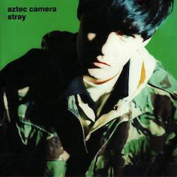

The next instalment in my understated classics series is &quot;Stray&quot; by [Aztec Camera](http://killermontstreet.net). Released in 1990, it features two hit singles and the cover is my favourite colour: green.

My angle for writing about “Stray” was that it was an album that I &quot;caught&quot; from my parents. I soon realised that I wrote about some of those already, for example “The Circle and the Square&quot; by Red Box. Besides, I’m not sure that my parents liked this album that much.

I remember my dad having a C90 in the car with this album on one side and [Billy Joel&#39;s album &quot;Storm Front&quot;](http://www.billyjoel.com/news/revisiting-billy-joels-storm-front-album-25-years-later/) on the other. &quot;Storm Front&quot; is a good album but not a great one. It starts with &quot;We Didn&#39;t Start The Fire&quot; but goes downhill from there. But that cassette might as well have had only one side because we rarely heard any of &quot;Stray&quot;. My dad’s always been one for sticking to what he likes and he didn’t seem to have any time for “Stray”. 

And nor did I until about 1996. I remember a rainy day in June or July of that year, between the last of my GCSEs and the start of my summer job. I was bored. So, in an age with much less choice and at a time when I had fewer sources of new things to listen to, I settled down to listen to some albums belonging to my parents. I avoided the LPs because back then turntables weren&#39;t as glamorous as they are now and I didn&#39;t want to scratch the records either. To a novice that needle-dropping stuff looked *complicated*.

I imagine my fingers tracing down the spines of the stack of twenty or so CDs wedged between the hifi and the acres of vinyl my parents owned. Billy Ocean? Nope. Billy Joel? Heard that. Bruce Springsteen? All the good ones are on vinyl. The Three Tenors at the Hollywood Bowl? No thanks. What&#39;s the Story Morning Glory? Again? Nah. And so I happened upon &quot;Stray&quot; by Aztec Camera.

Of course you&#39;ll remember Aztec Camera as the &#39;band&#39; that released “Somewhere In My Heart” in the 80s. Even if the band name means nothing to you, you&#39;ll know the song. It&#39;s irresistibly catchy: in another universe you&#39;re being [rick-rolled](https://en.wikipedia.org/wiki/Rickrolling) by it rather than &quot;Never Gonna Give You Up&quot;. But Aztec Camera aren&#39;t really a band. They started out as a collection of session musicians arranged around a talented songwriter Roddy Frame. As he gained confidence in his songwriting he embraced a solo approach and now he records under his own name, rather than Aztec Camera. 

&quot;Stray&quot; is an album at a transition point, showing off a songwriter halfway between torch singer and the leader of a fake band. Tellingly he’s alone on the cover. It&#39;s torn between two views of the world, uncertain of itself and quite unlike the records he&#39;d released beforehand. The songs themselves are either slow and moody, or raucous and agitated. There&#39;s no middle ground on &quot;Stray&quot; and as such it barely holds together, stretched in two directions by opposing forces. 

Maybe it was that tension which drew me in. Faced with my own line between the past of school and the future of working to earn my keep, perhaps I embraced the dichotomy of sneering songs like “Good Morning Britain” rubbing up against ballads like “Over My Head”. And of course, it might just be that it was a fine album featuring songs of a kind that I hadn’t paid much heed to before. 

Listening to it again as a “grown up”, I’m taken by how much of it I wouldn’t have understood. The title track seems to be a plea for a one night stand, but from a perspective I wouldn’t have appreciated until a few years ago. The sentiment of “Get Outta London” is something that I would have only got behind in the last few years (and listener, I did). At sixteen the line “don’t be too gay” in “Good Morning Britain” is something I might have glossed over or tried to ignore, these days it makes me angry just how much it enscapsulates the prevailing views of the establishment at the time.

The other interesting thing about “Stray” is that it’s an album that inverts song styles. The ‘sad’ slow songs are the happiest ones and most of the faster ‘brighter’ songs drip with cynicism. Even “The Crying Scene”, an upbeat song about making the most of your chances because “life’s a one-take movie”, manages to sound wary of believing its own advice. “How It Is” is darker still. 

The slow songs are where you find shafts of light. The title track exudes languid contentment despite its sad sack sound, “Over My Head” affects a grimace, and “Notting Hill Blues” yucks up your first world problems way before you ever hashtagged them. Meanwhile the closing “Song For A Friend” plaintively calls out for a belief in true love, but in a way that suggests it will actually arrive: “Stand straight in what kills you and confounds you / And break its chains and still believe”.

As an album that’s shifted in my perceptions over the years I’ve known it and one that I continue to enjoy, I have no hesitation in recommending “Stray” to you as an understated classic. 

(Fun fact: “Good Morning Britain” features [Mick Jones formerly of The Clash](https://en.wikipedia.org/wiki/Mick_Jones_(The_Clash_guitarist)) and Billy Joel’s “Storm Front” album was produced by [Mick Jones formerly of Foreigner](https://en.wikipedia.org/wiki/Mick_Jones_(Foreigner_guitarist))!)

